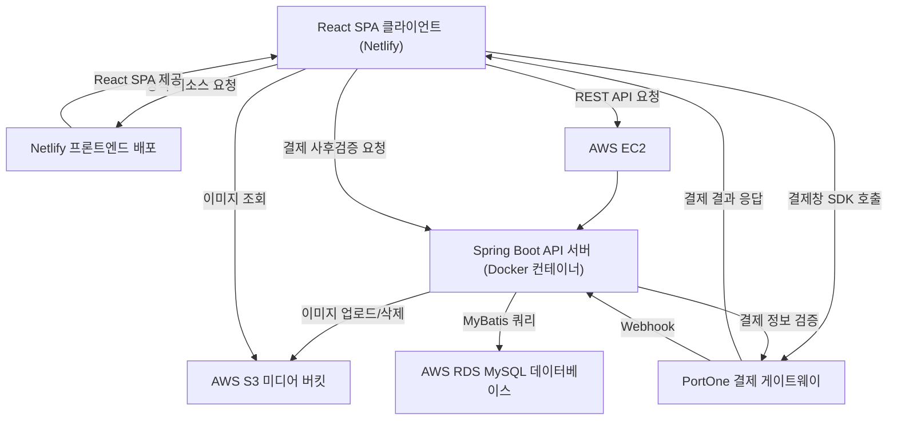

# 1. 시스템 아키텍처 설계서 (ITDA SNS)

## 목차
- [1. 시스템 아키텍처 설계서 (사자그램 SNS)](#1-시스템-아키텍처-설계서-ITDA-sns)
- [1.1 시스템 아키텍처 개요](#11-시스템-아키텍처-개요)
- [1.2 AWS 인프라 및 배포 아키텍처](#12-aws-인프라-및-배포-아키텍처)
- [1.3 결제/구독 및 데이터 흐름도](#13-결제구독-및-데이터-흐름도)

---

## 1.1 시스템 아키텍처 개요

ITDA 플랫폼은 클라이언트와 서버가 물리적으로 완전히 분리된 계층형 REST API 아키텍처 채택.

---

## 1.2 AWS 인프라 및 배포 아키텍처

### 1.2.1 프론트엔드 호스팅 (Netlify)
- 정적 사이트 빌드 배포:
  - React 애플리케이션을 빌드하여 Netlify를 통해 정적 프론트엔드로 배포.
  - Git 저장소와 Netlify를 연동하여 프론트엔드 코드 변경 시 자동 빌드 및 배포.
  - 별도의 백엔드 서버와 분리된 환경에서 React SPA를 제공하여 프론트엔드와 백엔드의 배포 환경을 독립적으로 구성.
  - 배포된 프론트엔드는 백엔드 API 서버의 도메인 (https://api.eony.site) 을 통해 REST API와 통신.
### 1.2.2 백엔드 및 데이터베이스 배포 (AWS EC2 + Docker Compose)
- 백엔드 컨테이너 환경:
  - AWS EC2 t3.medium 인스턴스에 Docker 및 Docker Compose 구성.
  - Spring Boot API 서버 애플리케이션 컨테이너(8080 포트)와 MySQL 9.x 데이터베이스 컨테이너(3306 포트) 내부 도커 네트워크 격리 연동.
  - 호스트 80/443 포트로 유입되는 API 트래픽을 컨테이너 8080 포트로 포워딩.
  - Docker Compose를 이용하여 Spring Boot 애플리케이션 컨테이너를 관리하고 이미지 업데이트 및 재배포를 수행.
  - 데이터베이스는 AWS RDS MySQL을 사용하며, RDS는 별도의 네트워크 환경에 구성하여 EC2의 Spring Boot 애플리케이션에서 접근하도록 구성.
  - EC2와 RDS 간의 데이터베이스 통신은 사설 네트워크를 통해 이루어지며, 데이터베이스를 외부에 직접 노출하지 않는 구조로 구성.
### 1.2.3 미디어 스토리지 및 파일 업로드 (AWS S3)
- 이미지 업로드 파이프라인:
  - 회원이 피드 이미지나 프로필 이미지를 등록할 때, 프론트엔드의 Multipart/form-data 요청을 Spring Boot 서버가 수신.
  - Spring Boot 서버는 AWS SDK for Java 2.x를 사용하여 S3 버킷의 `posts/` 및 `profiles/` 경로에 고유 UUID 파일명으로 안전하게 업로드.
  - 업로드 완료 후 생성된 S3 퍼블릭 객체 URL 또는 CloudFront 미디어 배포 URL을 DB의 `image_url` 컬럼에 영속화.
  - 업로드 파일은 용도에 따라 posts/, profiles/, themes/ 등의 디렉터리로 구분하여 저장.
  - 업로드 파일명은 UUID를 기반으로 생성하여 파일명 충돌을 방지.
  - 서버에서 이미지 파일의 크기와 Content-Type 및 실제 이미지 여부를 검증한 후 S3에 업로드.
  - DB에는 S3의 실제 파일 경로(Key)를 저장하고, 클라이언트에 이미지를 제공할 때 Presigned URL을 생성하여 전달.
  - 이미지 삭제 또는 교체 시 서버에서 기존 S3 객체를 삭제하여 불필요한 파일이 남지 않도록 처리.

### 1.2.4 도메인 간 리소스 공유 (CORS 정책)
- React 클라이언트(CloudFront 도메인)와 Spring Boot API 서버(EC2 도메인) 간 통신을 위해 Spring Security WebConfig에 CORS 정책 적용.
- 허용 오리진:
    - https://itda.likelion.shop
    - http://localhost:5173
- 허용 헤더: Authorization, Content-Type, X-Requested-With 등
- 허용 메서드: GET, POST, PUT, PATCH, DELETE, OPTIONS

---

## 1.3 결제/구독 및 데이터 흐름도

구독 및 단건 결제 위변조를 차단하기 위한 3단계 결제 검증 흐름.

### 1.3.1 단건 결제 및 사후 검증 흐름
1. 결제 준비 (클라이언트 -> 백엔드 -> PortOne): 클라이언트가 결제 요청 전 서버에 `POST /api/v1/payments/prepare`를 호출하여 고유 식별자(payment_id)와 결제 예정 금액 등록.
2. 결제창 호출 (클라이언트 -> PortOne/PG): 브라우저 결제창 SDK를 실행하여 결제 모듈 창을 띄우고 사용자가 카드 결제 완료.
3. 결제 완료 통보 (PortOne -> 클라이언트): 결제 모듈이 브라우저 콜백으로 결제 승인 고유 식별자(payment_id)와 주문 번호(transaction_id) 반환.
4. 사후 검증 및 저장 (클라이언트 -> 백엔드 -> PortOne): 클라이언트가 백엔드 `POST /api/v1/payments/complete`로 payment_id 전송. 백엔드는 결제사 REST API 서버로 직접 결제 내역을 단건 조회하여 실제 결제된 금액과 DB의 예정 금액이 일치하는지 위변조를 확인한 뒤 결제 완료(PAID) 상태로 갱신.

# [ADR-01] 프론트엔드 배포 환경 및 PG 결제 솔루션 선정

## 1. 결정 상태 (Status)
- 채택됨 (Accepted)

## 2. 배경 및 맥락 (Context)
- 2주간의 개발 기간 동안 안정적인 프론트엔드 배포 환경과 안전한 결제 시스템을 구축해야 하는 과제 직면.
- 프론트엔드는 별도의 배포 환경을 구성하여 백엔드와 분리하고, 빠른 배포 및 운영이 가능한 플랫폼을 선정할 필요가 있음.
- 구독 및 테마 결제 기능을 구현하기 위해 결제 승인, 결제 금액 검증, 결제 상태 확인 등의 서버 측 검증이 가능한 결제 솔루션이 필요함.

## 3. 검토 대안 (Alternatives Considered)
- 옵션 A: AWS S3 + CloudFront
- 옵션 B: Vercel, Netlify 플랫폼 연동
- 옵션 C: 토스페이먼츠 직접 연동 vs 포트원 간편 결제

## 4. 최종 결정 사항 (Decision)
- 프론트엔드 배포: Netlify 플랫폼 연동 채택
- 결제 솔루션: 포트원 간편 결제 채택

## 5. 선택 이유 (Rationale)
- 기술적 적합성: 팀원들의 기술 이해도 및 프로젝트 아키텍처와의 부합성.
- 비용 및 유지보수: 무료 티어 지원 여부 및 운영 오버헤드 최소화.
- 보안성: 사전/사후 검증 구현의 용이성 및 문서 완성도.

## 6. 결과 및 영향 (Consequences)
- 긍정적 효과: 배포 시간 단축, 결제 위변조 차단 등.
- 한계점 및 향후 개선 과제: 모바일 웹뷰 대응 추가 등.
