# 1. 데이터베이스 모델링 및 ERD 명세서 (ITDA SNS)

## 목차
- [1. 데이터베이스 모델링 및 ERD 명세서 (ITDA SNS)](#1-데이터베이스-모델링-및-erd-명세서-ITDA-sns)
- [1.1 엔티티 관계 다이어그램 (ERD)](#11-엔티티-관계-다이어그램-erd)
- [1.2 테이블별 상세 컬럼 명세](#12-테이블별-상세-컬럼-명세)

---

## 1.1 엔티티 관계 다이어그램 (ERD)

ITDA 서비스의 11개 핵심 도메인 테이블과 결제 및 구독을 위한 2개 테이블의 전체 구조도.

```mermaid
erDiagram
    MEMBER ||--|| MEMBER_DETAIL : "1:1 수직 분할"
    MEMBER ||--|| PROFILE : "1:1 프로필 통계"
    MEMBER ||--o{ POST : "1:N 작성"
    THEME ||--o{ MEMBER: "1:N 적용중인 테마 "
    MEMBER ||--o{ THEME_PURCHASE : "1:N 테마 구매"
	THEME ||--o{ THEME_PURCHASE : "1:N 구매 내역"   
    POST ||--o{ REPLY : "1:N 댓글 작성"
    MEMBER ||--o{ REPLY : "1:N 댓글 작성"
    MEMBER ||--o{ POST_LIKE : "1:N 좋아요"
    POST ||--o{ POST_LIKE : "1:N 게시글 좋아요"
    MEMBER ||--o{ POST_SCRAP : "1:N 스크랩"
    POST ||--o{ POST_SCRAP : "1:N 게시글 스크렙"
    POST }o--|| CATEGORY : "N:1 게시글 카테고리"
    MEMBER ||--o{ PAYMENT : "1:N 결제 이력"
    MEMBER ||--o{ FOLLOW : "1:N 팔로우"
    MEMBER ||--o{ SUBSCRIPTION : "1:N VIP 정기 구독"

    MEMBER {
        bigint id PK "회원 고유 식별자"
        varchar email "이메일 (UK)"
        varchar password "암호화된 비밀번호"
        varchar nickname "닉네임"
        varchar profile_image "프로필 이미지 S3 URL"
        bigint theme_id FK "현재 적용 테마 id"
        datetime updated_at"수정된 일시"
        datetime created_at "가입 일시"
    }

    MEMBER_DETAIL {
        bigint member_id PK, FK "회원 기본 키"
        text introduction "소개 글"
        varchar marketing_agreed "마케팅 수신 동의 (Y/N)"
    }

    POST {
        bigint id PK "게시글 고유 식별자"
        bigint member_id FK "작성자 회원 ID"
        text content "게시글 본문 텍스트"
        varchar image_url "게시글 첨부 이미지 S3 URL"
        int like_count "좋아요 집계 수"
        int reply_count "댓글 수"
        int view_count "조회 수"
        boolean is_subscribe "구독 전용 여부(0이면 전체 모든 유저 공개, 1이면 구독자 전용)"
        bigint category_id FK "카테고리 아이디"    
        datetime created_at "등록 일시"
        datetime updated_at "수정 일시"
    }

    REPLY {
        bigint id PK "댓글 고유 식별자"
        bigint post_id FK "게시글 게시글 ID"
        bigint member_id FK "작성자 회원 ID"
        text content "댓글 내용"
        datetime created_at "등록 일시"
    }

    POST_LIKE {
        bigint id PK "좋아요 고유 식별자"
        bigint member_id FK "좋아요 누른 회원 ID"
        bigint post_id FK "게시글 게시글 ID"
        datetime created_at "등록 일시"
    }
    
    POST_SCRAP {
        bigint id PK "스크랩 고유 식별자"
        bigint member_id FK "스크랩 누른 회원 ID"
        bigint post_id FK "게시글 ID"
        datetime created_at "등록 일시"
    }

    PAYMENT {
        bigint id PK "결제 고유 식별자"
        bigint member_id FK "결제 회원 ID"
        varchar imp_uid "결제 승인 고유번호"
        varchar merchant_uid "상점 고유 주문번호 (UK)"
        bigint amount "결제 금액"
        varchar status "결제 상태 (READY, PAID, FAILED, CANCELLED)"
        varchar pay_method "결제 수단 (card, trans 등)"
        datetime paid_at "결제 완료 일시"
        datetime created_at "등록 일시"
    }

    SUBSCRIPTION {
        bigint id PK "구독 고유 식별자"
        bigint member_id FK "내 회원 ID (UK)"
        bigint target_id FK "구독할 상대의 ID"
        varchar customer_uid "정기결제 빌링키"
        varchar plan_name "구독 플랜명 (VIP_MONTHLY) (없앨수도 있음)"
        bigint price "월 결제 금액"
        varchar status "구독 상태 (ACTIVE, PAUSED, CANCELLED)"
        datetime next_billing_at "다음 자동 결제 예정일"
        datetime started_at "구독 시작일"
        datetime ended_at "구독 종료일"
    }
    
    CATEGORY {
		    bigint id PK "카테고리 고유 식별자"
		    varchar category_name "카테고리 이름"  
    }
    
    THEME {
		    bigint id PK "테마 고유 식별자"
		    varchar theme_name "테마 이름"
		    varchar description "테마 설명"
		    bigint price "테마 가격"
		    varchar thumbnail_url "테마 미리보기 이미지 url"
		    varchar asset_url "테마 리소스 url"
		    datetime created_at "테마 등록 일시"
    }
    
    THEME_PURCHASE{
		    bigint id PK "구매한 테마 고유 식별자"
		    bigint member_id FK "회원 ID"
		    bigint theme_id FK "테마 ID"
		    bigint payment_id FK "테마 결제 ID"
		    datetime created_at "구매한 일시"
	}
    
    FOLLOW {
		    bigint id PK "팔로우 고유 식별자"
		    bigint from_id FK "팔로우 한 사람의 아이디"
		    bigint to_id FK "팔로우 대상 아이디"
		    datetime created_at "팔로우한 일시"
    }
    
    PROFILE {
		    bigint id PK "프로필 고유 식별자"
		    bigint member_id FK "멤버 아이디"
		    bigint follower "팔로워 수"
		    bigint following "팔로잉 수"
		    int post_count "게시글 수"
    }
```

---

## 1.2 테이블별 상세 컬럼 명세

### 1.2.1 member (회원 기본)

| 컬럼명 | 데이터 타입 | 제약 조건 | 설명 |
| --- | --- | --- | --- |
| id | BIGINT | PK, NOT NULL, AUTO_INCREMENT | 회원 고유 식별자 |
| email | VARCHAR(100) | UNIQUE, NOT NULL, | 로그인 아이디 (이메일) |
| password | VARCHAR(255) | NOT NULL | BCrypt 암호화된 비밀번호 |
| nickname | VARCHAR(50) | NOT NULL | 화면 표시용 닉네임 |
| profile_image | VARCHAR(255) | NULL | AWS S3 프로필 사진 URL |
| theme_id | BIGINT | FK(theme.id), DEFAUL NULL | 현재 적용 중인 테마 ID, THEME.id 참조 |
| updated_at | DATETIME | NOT NULL, DEFAULT CURRENT_TIMESTAMP | 회원 정보 수정 일시 |
| created_at | DATETIME | NOT NULL, DEFAULT CURRENT_TIMESTAMP | 계정 생성 일시 |

### 1.2.2 member_detail (회원 상세 - 1:1 수직 분할)

| 컬럼명 | 데이터 타입 | 제약 조건 | 설명 |
| --- | --- | --- | --- |
| member_id | BIGINT | PK, FK (member.id ON DELETE CASCADE), NOT NULL | 회원 식별자 |
| introduction | TEXT | NULL | 소개 글 |
| marketing_agreed | VARCHAR(1) | DEFAULT 'N' | 마케팅 정보 수신 동의 여부 (Y/N) |

### 1.2.3 post (게시글)

| 컬럼명 | 데이터 타입 | 제약 조건 | 설명 |
| --- | --- | --- | --- |
| id | BIGINT | PK, NOT NULL, AUTO_INCREMENT | 피드 게시글 고유 식별자 |
| member_id | BIGINT | FK, NOT NULL | 작성자 회원 식별자 |
| category_id | INT | FK (category.id), NOT NULL | 게시글 카테고리 식별자 |
| content | TEXT | NOT NULL | 피드 본문 내용 |
| image_url | VARCHAR(255) | NULL | 피드 첨부 이미지 S3 URL |
| like_count | INT | DEFAULT 0 | 좋아요 누적 카운트 |
| reply_count | INT | DEFAULT 0 | 댓글 수 |
| view_count | INT | DEFAULT 0 | 게시글 조회 수 |
| is_subscribe | BOOLEAN | DEFAULT FALSE | 구독 전용 여부 (FALSE: 전체 공개, TRUE: 구독자 전용) |
| created_at | DATETIME | DEFAULT CURRENT_TIMESTAMP | 피드 최초 작성 일시 |
| updated_at | DATETIME | DEFAULT CURRENT_TIMESTAMP ON UPDATE | 피드 최종 수정 일시 |

### 1.2.4 reply (게시글 댓글)

| 컬럼명 | 데이터 타입 | 제약 조건 | 설명 |
| --- | --- | --- | --- |
| id | BIGINT | PK, NOT NULL, AUTO_INCREMENT | 댓글 고유 식별자 |
| post_id | BIGINT | FK(post.id), NOT NULL, | 댓글이 달린 게시글 식별자 |
| member_id | BIGINT | FK(member.id), NOT NULL | 댓글 작성자 식별자 |
| content | TEXT | NOT NULL | 댓글 텍스트 내용 |
| created_at | DATETIME | NOT NULL, CURRENT_TIMESTAMP | 댓글 등록 일시 |

### 1.2.5 post_like (게시글 좋아요 - N:M 매핑)

| 컬럼명 | 데이터 타입 | 제약 조건 | 설명 |
| --- | --- | --- | --- |
| id | BIGINT | PK, NOT NULL, AUTO_INCREMENT | 좋아요 식별자 |
| member_id | BIGINT | FK (member.id ), NOT NULL, | 좋아요를 누른 회원 ID |
| post_id | BIGINT | FK(post.id), NOT NULL | 대상 게시글 게시글 ID |
| created_at | DATETIME | NOT NULL, DEFAULT CURRENT_TIMESTAMP | 좋아요 등록 일시 |
- 고유 제약조건: UNIQUE KEY `uk_member_post_like` (`member_id`, `post_id`)

### 1.2.6 post_scrap (피드 스크랩 - N:M 매핑)

| 컬럼명 | 데이터 타입 | 제약 조건 | 설명 |
| --- | --- | --- | --- |
| id | BIGINT | PK, AUTO_INCREMENT | 스크랩 고유 식별자 |
| member_id | BIGINT | FK (member.id ON DELETE CASCADE), NOT NULL | 스크랩한 회원 ID |
| post_id | BIGINT | FK (post.id ON DELETE CASCADE), NOT NULL | 스크랩 대상 게시글 ID |
| created_at | DATETIME | NOT NULL DEFAULT CURRENT_TIMESTAMP | 스크랩 등록 일시 |
- 고유 제약조건: UNIQUE KEY `uk_member_post_scrap` (`member_id`, `post_id`)

### 1.2.7 payment (결제 이력)

| 컬럼명 | 데이터 타입 | 제약 조건 | 설명 |
| --- | --- | --- | --- |
| id | BIGINT | PK, NOT NULL, AUTO_INCREMENT | 결제 내역 고유 식별자 |
| member_id | BIGINT | FK (member.id ON DELETE CASCADE), NOT NULL | 결제 회원 ID |
| imp_uid | VARCHAR(100) | NULL | 결제 승인 고유 번호 |
| merchant_uid | VARCHAR(100) | UNIQUE, NOT NULL  | 자체 생성 주문 식별자 |
| amount | INT | NOT NULL | 결제 금액 |
| status | VARCHAR(20) | DAFAULT ‘READY’ | 결제 상태 (READY, PAID, FAILED, CANCELLED) |
| pay_method | VARCHAR(30) | NOT NULL | 결제 수단 (card, trans 등) |
| paid_at | DATETIME | NULL | 실제 결제 완료 시각 |
| created_at | DATETIME | DEFAULT CURRENT_TIMESTAMP | 결제 요청 시각 |

### 1.2.8 subscription (사용자 정기 구독)

| 컬럼명 | 데이터 타입 | 제약 조건 | 설명 |
| --- | --- | --- | --- |
| id | BIGINT | PK, NOT NULL, AUTO_INCREMENT | 구독 고유 식별자 |
| member_id | BIGINT | FK (member.id ON DELETE CASCADE), NOT NULL | 구독하는 회원 ID |
| target_id | BIGINT | FK (member.id ON DELETE CASCADE), NOT NULL | 구독 대상 회원 ID |
| customer_uid | VARCHAR(100) | NOT NULL | 정기 결제 카드 빌링키 |
| plan_name | VARCHAR(50) | NOT NULL | 구독 플랜 이름 |
| price | INT | NOT NULL | 매월 정기 결제 금액 |
| status | VARCHAR(20) | NOT NULL, DEFAULT 'ACTIVE' | 구독 상태 (ACTIVE, PAUSED, CANCELLED) |
| next_billing_at | DATETIME | NOT NULL | 다음 자동 결제 예정일 |
| started_at | DATETIME | DEFAULT CURRENT_TIMESTAMP | 구독 시작일 |
| ended_at | DATETIME | NULL  | 구독 종료일 |

### 1.2.9 category (게시글 카테고리)

| 컬럼명 | 데이터 타입 | 제약 조건 | 설명 |
| --- | --- | --- | --- |
| id | BIGINT | PK, AUTO_INCREMENT | 카테고리 고유 식별자 |
| category_name | VARCHAR(50) | UNIQUE, NOT NULL | 카테고리 이름 |

### 1.2.10 theme (사이트 등록 테마)

| 컬럼명 | 데이터 타입 | 제약 조건 | 설명 |
| --- | --- | --- | --- |
| id | INT | PK, AUTO_INCREMENT | 테마 고유 식별자 |
| theme_name | VARCHAR(100) | NOT NULL | 테마 이름 |
| description | VARCHAR(255) | NULL | 테마 설명 |
| price | INT | NOT NULL | 테마 가격 |
| thumbnail_url | VARCHAR(255) | NULL | 테마 미리보기 이미지 URL |
| asset_url | VARCHAR(255) | NULL | 테마 리소스 URL |
| created_at | DATETIME | DEFAULT CURRENT_TIMESTAMP | 테마 등록 일시 |

### 1.2.11 theme_purchase (구매한 테마)

| 컬럼명 | 데이터 타입 | 제약 조건 | 설명 |
| --- | --- | --- | --- |
| id | INT | PK, AUTO_INCREMENT | 구매한 테마 고유 식별자 |
| member_id | BIGINT | FK (member.id ON DELETE CASCADE), NOT NULL | 테마를 구매한 회원 ID |
| theme_id | BIGINT | FK (theme.id ON DELETE CASCADE), NOT NULL, | 구매한 테마 ID |
| payment_id | BIGINT | FK (payment.id), NOT NULL | 테마 결제 ID |
| created_at | DATETIME | DEFAULT CURRENT_TIMESTAMP | 테마 구매 일시 |
- 고유 제약조건: UNIQUE KEY `uk_member_theme_purchase` (`member_id`, `theme_id`)

### 1.2.12 follow (회원 팔로우)

| 컬럼명 | 데이터 타입 | 제약 조건 | 설명 |
| --- | --- | --- | --- |
| id | INT | PK, AUTO_INCREMENT | 팔로우 고유 식별자 |
| from_id | INT | FK (member.id ON DELETE CASCADE), NOT NULL | 팔로우한 회원 ID |
| to_id | INT | FK (member.id ON DELETE CASCADE), NOT NULL | 팔로우 대상 회원 ID |
| created_at | DATETIME | DEFAULT CURRENT_TIMESTAMP | 팔로우한 일시 |
- 고유 제약조건: UNIQUE KEY `uk_member_follow` (`from_id`, `to_id`)

### 1.2.13 profile (프로필)

| 컬럼명 | 데이터 타입 | 제약 조건 | 설명 |
| --- | --- | --- | --- |
| id | INT | PK, AUTO_INCREMENT | 프로필 고유 식별자 |
| member_id | INT | FK (member.id ON DELETE CASCADE), UNIQUE, NOT NULL | 회원 식별자 |
| follower | INT | DEFAULT 0 | 팔로워 수 |
| following | INT | DEFAULT 0 | 팔로잉 수 |
| post_count | INT | DEFAULT 0 | 게시글 수 |

