# 1. 데이터베이스 모델링 및 ERD 명세서 (ITDA SNS)

## 목차
- [1. 데이터베이스 모델링 및 ERD 명세서 (ITDA SNS)](#1-데이터베이스-모델링-및-erd-명세서-ITDA-sns)
- [1.1 엔티티 관계 다이어그램 (ERD)](#11-엔티티-관계-다이어그램-erd)
- [1.2 테이블별 상세 컬럼 명세](#12-테이블별-상세-컬럼-명세)

---

## 1.1 엔티티 관계 다이어그램 (ERD)

ITDA 서비스의 11개 핵심 도메인 테이블과 결제 및 구독을 위한 2개 테이블의 전체 구조도.

```mermaid
erDiagram
    MEMBER ||--o{ POST : "1:N 작성"
    MEMBER ||--o{ MEMBER_INTEREST : "관심 카테고리"
		CATEGORY ||--o{ MEMBER_INTEREST : "관심 회원"
    THEME ||--o{ MEMBER: "1:N 적용중인 테마 "
    MEMBER ||--o{ THEME_PURCHASE : "1:N 테마 구매"
	  THEME ||--o{ THEME_PURCHASE : "1:N 구매 내역"   
    POST ||--o{ REPLY : "1:N 댓글 작성"
    MEMBER ||--o{ REPLY : "1:N 댓글 작성"
    MEMBER ||--o{ POST_REACTION : "1:N 좋아요/스크랩"
    POST ||--o{ POST_REACTION : "1:N 게시글 좋아요/스크랩"
    POST }o--|| CATEGORY : "N:1 게시글 카테고리"
    MEMBER ||--o{ PAYMENT : "1:N 결제 이력"
    MEMBER ||--o{ FOLLOW : "1:N 팔로우"
    MEMBER ||--o{ SUBSCRIPTION : "1:N 내가 다른 사용자 구독"
    MEMBER ||--o{ SUBSCRIPTION : "1:N 다른 사용자가 나를 구독"
    COMMON_CODE ||--o{ SUBSCRIPTION : "1:N 결제가 여러 구독에서 사용됨"
    PAYMENT ||--|| SUBSCRIPTION : "1:1 결제 한번에 구독 하나"
    PAYMENT ||--|| THEME : "1:1 결제 한번에 테마 하나"

    MEMBER {
        bigint id PK "회원 고유 식별자"
        varchar email "이메일 (UK)"
        varchar password "암호화된 비밀번호"
        varchar nickname "닉네임"
        varchar role "ROLE_USER, ROLE_ADMIN"
        varchar introduction "소개글"
        varchar profile_image "프로필 이미지 S3 URL"
        bigint theme_id FK "현재 적용 테마 id (가입 시 기본테마, NOT NULL)"
        varchar authmethod "로그인 인증 방식(google/kakao/local)"
        bigint month_income "월간 정산 금액"
        datetime updated_at "수정된 일시"
        datetime created_at "가입 일시"
    }
    
    MEMBER_INTEREST {
		    bigint id PK "회원 관심 카테고리 고유 식별자"
		    bigint member_id FK "회원 ID"
		    bigint category_id FK "관심 카테고리 ID"
		}

    POST {
        bigint id PK "게시글 고유 식별자"
        bigint member_id FK "작성자 회원 ID"
        text content "게시글 본문 텍스트"
        varchar image_url "게시글 첨부 이미지 S3 URL"
        int like_count "좋아요 집계 수"
        int view_count "조회 수"
        boolean subscriber_only "구독 전용 여부(FALSE면 전체 모든 유저 공개, TRUE면 구독자 전용)"
        bigint category_id FK "카테고리 아이디"  
        datetime updated_at "수정 일시"  
        datetime created_at "등록 일시"
    }

    REPLY {
        bigint id PK "댓글 고유 식별자"
        bigint post_id FK "게시글 게시글 ID"
        bigint member_id FK "작성자 회원 ID"
        text content "댓글 내용"
        datetime updated_at "수정 일시"
        datetime created_at "등록 일시"
    }

    POST_REACTION {
        bigint id PK "좋아요 고유 식별자"
        bigint member_id FK "좋아요 누른 회원 ID"
        bigint post_id FK "게시글 ID"
        int type "1이면 좋아요, 2이면 스크랩"
        datetime created_at "등록 일시"
    }

    PAYMENT {
        bigint id PK "결제 고유 식별자"
        bigint member_id FK "결제 회원 ID"
        varchar payment_type "theme, subscription 등 결제 타입"
        bigint target_id "결제 대상 id payment_type = theme : theme테이블 id, payment_type =subscription : subsctiption테이블의 id"
        varchar imp_uid "결제 승인 고유번호"
        varchar merchant_uid "상점 고유 주문번호 (UK)"
        bigint amount "결제 금액"
        bigint status_id "TYPE 1/ 결재 상태 (READY, PAID, FAILED, CANCELLED)"
        varchar pay_method_id "TYPE 2/ 결제 수단 (card, trans등)"
        datetime paid_at "결제 완료 일시"
        datetime created_at "등록 일시"
    }

    SUBSCRIPTION {
        bigint id PK "구독 고유 식별자"
        bigint member_id FK "내 회원 ID"
        bigint target_id FK "구독할 상대의 ID"
        varchar customer_uid FK "정기결제 빌링키(암호화 저장)"
        bigint price_id "TYPE 3/ 월 결제 금액"
        bigint status_id "TYPE 4 / 구독 상태 (ACTIVE, PAUSED, CANCELLED)"
        datetime next_billing_at "다음 자동 결제 예정일"
        datetime started_at "구독 시작일"
        datetime ended_at "구독 종료일"
    }
 
    CATEGORY {
		    bigint id PK "카테고리 고유 식별자"
		    varchar category_name "카테고리 이름 (UK)"  
    }
    COMMON_CODE {
		    bigint id PK "고유 식별자"
		    int type "1: payment_status(결제 상태), 2: payment_pay_method(결제 수단), 3: subscription_price(월 결제 금액), 4: subscription_status(구독 상태)"
		    varchar code "실제 DB에 저장될 값(ca10)"
				varchar name "사용자에게 보여주는 텍스트(맛집, 여행)"
				varchar description "관리자 페이지에서 코드에 대한 설명"
				int order "정렬 기준(1,2,3,4)"
  	    boolean is_active "활성화 여부"
    }

    THEME {
		    bigint id PK "테마 고유 식별자"
		    varchar theme_name "테마 이름"
		    varchar description "테마 설명"
		    bigint price "테마 가격, 기본 테마는 0원"
		    varchar thumbnail_url "테마 미리보기 이미지 url"
		    varchar theme_code "프론트에서 사용할 테마 키 (UK)"
		    varchar status "상점 노출, on_sale/hidden 등 상태"
		    boolean is_default "기본 테마 1개만 true"
		    datetime updated_at "테마 수정 일시"
		    datetime created_at "테마 등록 일시"
    }
    
    THEME_PURCHASE{
		    bigint id PK "구매한 테마 고유 식별자"
		    bigint member_id FK "회원 ID"
		    bigint theme_id FK "테마 ID"
		    bigint payment_id FK "테마 결제 ID (NULL 허용)"
		    boolean apply_theme "테마 적용 여부"
		    datetime created_at "구매한 일시"
	}
    
    FOLLOW {
		    bigint id PK "팔로우 고유 식별자"
		    bigint from_id FK "팔로우 한 사람의 아이디"
		    bigint to_id FK "팔로우 대상 아이디"
		    datetime created_at "팔로우한 일시"
    }
    
   
```

---

## 1.2 테이블별 상세 컬럼 명세

### 1.2.1 member (회원 기본)

| 컬럼명           | 데이터 타입       | 제약 조건                                                           | 설명 |
|---------------|--------------|-----------------------------------------------------------------| --- |
| id            | BIGINT       | PK, NOT NULL, AUTO_INCREMENT                                    | 회원 고유 식별자 |
| email         | VARCHAR(100) | UNIQUE, NOT NULL                                                | 로그인 아이디 (이메일) |
| password      | VARCHAR(255) | NOT NULL                                                        | BCrypt 암호화된 비밀번호 |
| nickname      | VARCHAR(50)  | NOT NULL, DEFAULT “철수”                                          | 화면 표시용 닉네임 |
| role          | VARCHAR(20)  | NOT NULL, DEFAULT “ROLE_USER”                                   | 회원 권한 |
| profile_image | VARCHAR(255) | NULL                                                            | AWS S3 프로필 사진 URL |
| theme_id      | BIGINT       | FK (theme.id), NOT NULL                                         | 현재 적용 테마 ID. 가입 시 기본 테마(`theme.is_default = TRUE`) |
| introduction  | VARCHAR(255) | NULL                                                            | 소개글   |
| authmethod    | VARCHAR(20) | NOT NULL                                                        | 로그인 인증 방식(google/kakao/local)   |
| month_income  | BIGINT       | NULL                                                            | 월간 정산 금액   |
| updated_at    | DATETIME     | NOT NULL, DEFAULT CURRENT_TIMESTAMP ON UPDATE CURRENT_TIMESTAMP | 회원 정보 수정 일시 |
| created_at    | DATETIME     | NOT NULL, DEFAULT CURRENT_TIMESTAMP                             | 계정 생성 일시 |

### 1.2.2 member_interest (회원 관심 카테고리)

| 컬럼명 | 데이터 타입 | 제약 조건 | 설명 |
| --- | --- | --- | --- |
| id | BIGINT | PK, NOT NULL, AUTO_INCREMENT | 회원 관심 카테고리 고유 식별자 |
| member_id| BIGINT | FK(member.id), NOT NULL | 회원 ID |
| category_id | BIGINT | FK(category.id), NOT NULL | 관심 카테고리 ID |

### 1.2.3 post (게시글)

| 컬럼명 | 데이터 타입 | 제약 조건 | 설명                                    |
| --- | --- | --- |---------------------------------------|
| id | BIGINT | PK, NOT NULL, AUTO_INCREMENT | 게시글 고유 식별자                            |
| member_id | BIGINT | FK (member.id), NOT NULL | 작성자 회원 식별자                            |
| category_id | BIGINT | FK (category.id), NOT NULL | 게시글 카테고리 식별자                          |
| content | TEXT | NOT NULL | 본문 내용                                 |
| image_url | VARCHAR(255) | NULL | 첨부 이미지 S3 URL                         |
| like_count | INT | NOT NULL, DEFAULT 0 | 좋아요 누적 카운트                            |
| view_count | INT | NOT NULL, DEFAULT 0 | 게시글 조회 수                              |
| subscriber_only | BOOLEAN | DEFAULT FALSE | 구독 전용 여부 (FALSE: 전체 공개, TRUE: 구독자 전용) |
| updated_at | DATETIME | NOT NULL, DEFAULT CURRENT_TIMESTAMP ON UPDATE CURRENT_TIMESTAMP | 수정 일시                                 |
| created_at | DATETIME | NOT NULL, DEFAULT CURRENT_TIMESTAMP | 등록 일시                                 |

### 1.2.4 reply (게시글 댓글)

| 컬럼명 | 데이터 타입 | 제약 조건                                    | 설명 |
| --- | --- |------------------------------------------| --- |
| id | BIGINT | PK, NOT NULL, AUTO_INCREMENT             | 댓글 고유 식별자 |
| post_id | BIGINT | FK (post.id ON DELETE CASCADE), NOT NULL | 댓글이 달린 게시글 식별자 |
| member_id | BIGINT | FK (member.id), NOT NULL                 | 댓글 작성자 식별자 |
| content | TEXT | NOT NULL                                 | 댓글 텍스트 내용 |
| updated_at | DATETIME | DEFAULT CURRENT_TIMESTAMP ON UPDATE      | 댓글 수정 일시 |
| created_at | DATETIME | NOT NULL, DEFAULT CURRENT_TIMESTAMP      | 댓글 등록 일시 |

### 1.2.5 post_reaction (게시글 좋아요, 스크랩 - N:M 매핑)

| 컬럼명 | 데이터 타입 | 제약 조건 | 설명               |
| --- | --- | --- |------------------|
| id | BIGINT | PK, NOT NULL, AUTO_INCREMENT | 좋아요 식별자          |
| member_id | BIGINT | FK (member.id ON DELETE CASCADE), NOT NULL | 좋아요를 누른 회원 ID    |
| post_id | BIGINT | FK (post.id ON DELETE CASCADE), NOT NULL | 대상 게시글 ID        |
| type    |  INT   | NOT NULL | 1이면 좋아요, 2이면 스크랩 |
| created_at | DATETIME | NOT NULL, DEFAULT CURRENT_TIMESTAMP | 좋아요 등록 일시        |

- 고유 제약조건: UNIQUE KEY `uk_member_post_like` (`member_id`, `post_id`)

### 1.2.6 payment (결제 이력)

| 컬럼명 | 데이터 타입 | 제약 조건 | 설명 |
| --- | --- | --- | --- |
| id | BIGINT | PK, NOT NULL, AUTO_INCREMENT | 결제 내역 고유 식별자 |
| member_id | BIGINT | FK (member.id), NOT NULL | 결제 회원 ID |
| payment_type | VARCHAR(20) | NOT NULL | 결제 구분 (`THEME`, `SUBSCRIPTION`) |
| target_id | BIGINT | NOT NULL |결제 대상 id payment_type = theme : theme테이블 id, payment_type =subscription : subsctiption테이블의 id|
| imp_uid | VARCHAR(100) | NULL | 결제 승인 고유 번호 |
| merchant_uid | VARCHAR(100) | UNIQUE, NOT NULL | 상점 주문번호 |
| amount | BIGINT | NOT NULL | 결제 금액 |
| status_id | BIGINT | FK (COMMON_CODE.id), NOT NULL, DEFAULT 1 | 결제 상태 코드 (`READY`, `PAID`, `FAILED`, `CANCELLED`) |
| pay_method_id | BIGINT | FK (COMMON_CODE.id), NOT NULL | 결제 수단 (`card`, `trans` 등). 요청 전에는 NULL 가능 |
| paid_at | DATETIME | NULL | 실제 결제 완료 시각 (`PAID`일 때만) |
| created_at | DATETIME | NOT NULL, DEFAULT CURRENT_TIMESTAMP | 결제 요청 시각 |

### 1.2.7 subscription (사용자 정기 구독)

| 컬럼명 | 데이터 타입 | 제약 조건 | 설명 |
| --- | --- | --- | --- |
| id | BIGINT | PK, NOT NULL, AUTO_INCREMENT | 구독 고유 식별자 |
| member_id | BIGINT | FK (member.id ON DELETE CASCADE), NOT NULL | 구독하는 회원 ID |
| target_id | BIGINT | FK (member.id ON DELETE CASCADE), NOT NULL | 구독 대상 회원 ID |
| customer_uid | VARCHAR(100) | NOT NULL | 정기결제 빌링키(암호화 저장) |
| price_id | INT | NOT NULL | 매월 정기 결제 금액 |
| status_id | INT | NOT NULL, DEFAULT 'ACTIVE' | 구독 상태 (`ACTIVE`, `PAUSED`, `CANCELLED`) |
| next_billing_at | DATETIME | NOT NULL | 다음 자동 결제 예정일 |
| started_at | DATETIME | NOT NULL, DEFAULT CURRENT_TIMESTAMP | 구독 시작일 |
| ended_at | DATETIME | NULL | 구독 종료일 |

- 고유 제약조건: UNIQUE KEY `uk_subscription_member_target` (`member_id`, `target_id`)
- CHECK (`member_id` <> `target_id`)

### 1.2.8 common_code (공통 코드)

| 컬럼명         | 데이터 타입 | 제약 조건 | 설명                                                                                                                                         |
|-------------| --- | --- |--------------------------------------------------------------------------------------------------------------------------------------------|
| id          | BIGINT | PK, AUTO_INCREMENT | 고유 식별자                                                                                                                                     |
| type        |  INT   |  NOT NULL  | 1: payment_status(결제 상태),2: payment_pay_method(결제 수단), 3: subscription_price(월 결제 금액), 4: subscription_status(구독 상태), 5: category(카테고리 종류) |
| code        | CHAR(4) | NOT NULL | 실제 DB에 저장될 값(ca10)                                                                                                                         |
| name        | VARCHAR(30) | NOT NULL  |   사용자에게 보여주는 텍스트(맛집, 여행, 독서 등)                                                                                              |
| description | VARCHAR(255 | NOT NULL |  관리자 페이지에서 코드에 대한 설명                                                                                                       |
| order    | INT  | DEFAULT 0   |  정렬 기준(1,2,3,4..)                                                                                                                           |
| is_active     | BOOLEAN  | NOT NULL, DEFAULT  1  | 활성화 여부                                                                                                                            |

### 1.2.9 theme (사이트 등록 테마)

| 컬럼명 | 데이터 타입 | 제약 조건 | 설명 |
| --- | --- | --- | --- |
| id | BIGINT | PK, NOT NULL, AUTO_INCREMENT | 테마 고유 식별자 |
| theme_name | VARCHAR(100) | NOT NULL | 테마 이름 |
| description | VARCHAR(255) | NULL | 테마 설명 |
| price | INT | NOT NULL, DEFAULT 0 | 테마 가격. 기본 테마는 0원 |
| thumbnail_url | VARCHAR(255) | NULL | 테마 미리보기 이미지 URL |
| theme_code | VARCHAR(255) | UNIQUE, NOT NULL | 프론트 `data-theme` 키 (`calm`, `vivid` 등) |
| status | VARCHAR(255) | NOT NULL, DEFAULT 'ON_SALE' | 상점 노출 (`ON_SALE`, `HIDDEN`) |
| is_default | BOOLEAN | NOT NULL, DEFAULT FALSE | 가입 시 적용할 기본 테마. true인 행은 전체 1개만 |
| updated_at | DATETIME | NULL, DEFAULT CURRENT_TIMESTAMP ON UPDATE CURRENT_TIMESTAMP | 테마 수정 일시 |
| created_at | DATETIME | NOT NULL, DEFAULT CURRENT_TIMESTAMP | 테마 등록 일시 |

- `is_default = TRUE`인 행은 1개만 유지 (부분 UNIQUE 또는 애플리케이션에서 강제)

### 1.2.10 theme_purchase (구매한 테마)

| 컬럼명 | 데이터 타입 | 제약 조건 | 설명 |
| --- | --- | --- | --- |
| id | BIGINT | PK, NOT NULL, AUTO_INCREMENT | 구매한 테마 고유 식별자 |
| member_id | BIGINT | FK (member.id ON DELETE CASCADE), NOT NULL | 테마를 구매한 회원 ID |
| theme_id | BIGINT | FK (theme.id), NOT NULL | 구매한 테마 ID |
| payment_id | BIGINT | FK (payment.id), NULL | 유료 결제일 때만 채움. 0원/기본 테마는 NULL |
| apply_theme | boolean  | NULL  | 테마 적용 여부 |
| created_at | DATETIME | NOT NULL, DEFAULT CURRENT_TIMESTAMP | 테마 구매 일시 |

- 고유 제약조건: UNIQUE KEY `uk_member_theme_purchase` (`member_id`, `theme_id`)

### 1.2.11 follow (회원 팔로우)

| 컬럼명 | 데이터 타입 | 제약 조건 | 설명 |
| --- | --- | --- | --- |
| id | BIGINT | PK, NOT NULL, AUTO_INCREMENT | 팔로우 고유 식별자 |
| from_id | BIGINT | FK (member.id ON DELETE CASCADE), NOT NULL | 팔로우한 회원 ID |
| to_id | BIGINT | FK (member.id ON DELETE CASCADE), NOT NULL | 팔로우 대상 회원 ID |
| created_at | DATETIME | NOT NULL, DEFAULT CURRENT_TIMESTAMP | 팔로우한 일시 |

- 고유 제약조건: UNIQUE KEY `uk_member_follow` (`from_id`, `to_id`)
- CHECK (`from_id` <> `to_id`)

