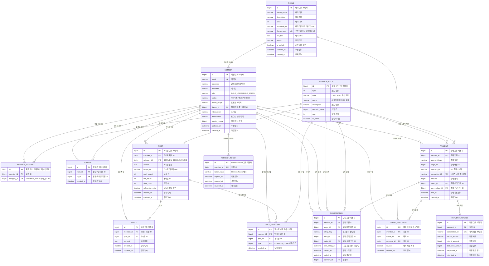

# 1. 데이터베이스 모델링 및 ERD 명세서 (ITDA SNS)

## 목차
- [1. 데이터베이스 모델링 및 ERD 명세서 (ITDA SNS)](#1-데이터베이스-모델링-및-erd-명세서-ITDA-sns)
- [1.1 엔티티 관계 다이어그램 (ERD)](#11-엔티티-관계-다이어그램-erd)
- [1.2 테이블별 상세 컬럼 명세](#12-테이블별-상세-컬럼-명세)

---

## 1.1 엔티티 관계 다이어그램 (ERD)

ITDA 서비스의 11개 핵심 도메인 테이블과 결제 및 구독을 위한 2개 테이블의 전체 구조도.

# ITDA ERD

```mermaid
erDiagram

    THEME ||--o{ MEMBER : "현재 적용 테마"

    MEMBER ||--o{ MEMBER_INTEREST : "관심 카테고리"
    COMMON_CODE ||--o{ MEMBER_INTEREST : "카테고리"

    MEMBER ||--o{ FOLLOW : "팔로우 회원"
    MEMBER ||--o{ FOLLOW : "팔로우 대상"

    MEMBER ||--o{ POST : "게시글 작성"
    COMMON_CODE ||--o{ POST : "게시글 카테고리"

    MEMBER ||--o{ REPLY : "댓글 작성"
    POST ||--o{ REPLY : "댓글"

    MEMBER ||--o{ POST_REACTION : "좋아요/스크랩"
    POST ||--o{ POST_REACTION : "게시글 반응"
    COMMON_CODE ||--o{ POST_REACTION : "반응 타입"

    MEMBER ||--o{ PAYMENT : "결제"
    COMMON_CODE ||--o{ PAYMENT : "결제 상태"
    COMMON_CODE ||--o{ PAYMENT : "결제 수단"

    MEMBER ||--o{ SUBSCRIPTION : "구독자"
    MEMBER ||--o{ SUBSCRIPTION : "구독 대상"
    COMMON_CODE ||--o{ SUBSCRIPTION : "구독 가격"
    COMMON_CODE ||--o{ SUBSCRIPTION : "구독 상태"
    PAYMENT ||--o{ SUBSCRIPTION : "구독 결제"

    MEMBER ||--o{ THEME_PURCHASE : "테마 구매"
    THEME ||--o{ THEME_PURCHASE : "구매된 테마"
    PAYMENT ||--o{ THEME_PURCHASE : "테마 결제"

    MEMBER ||--o{ REFRESH_TOKEN : "Refresh Token"

    PAYMENT ||--o| PAYMENT_REFUND : "결제 환불"


    COMMON_CODE {
        bigint id PK "공통 코드 고유 식별자"
        int type "코드 종류"
        varchar code "CA10, PS01 등의 코드"
        varchar name "사용자에게 표시할 이름"
        varchar description "코드 설명"
        bigint numeric_value "숫자 값"
        int sort "정렬 순서"
        boolean is_active "활성화 여부"
    }


    THEME {
        bigint id PK "테마 고유 식별자"
        varchar theme_name "테마 이름"
        varchar description "테마 설명"
        int price "테마 가격"
        varchar thumbnail_url "테마 미리보기 이미지 URL"
        varchar theme_code UK "프론트에서 사용할 테마 키"
        text css_text "테마 CSS"
        varchar status "판매 상태"
        boolean is_default "기본 테마 여부"
        datetime updated_at "수정 일시"
        datetime created_at "등록 일시"
    }


    MEMBER {
        bigint id PK "회원 고유 식별자"
        varchar email UK "이메일"
        varchar password "암호화된 비밀번호"
        varchar nickname "닉네임"
        varchar role "ROLE_USER / ROLE_ADMIN"
        varchar status "ACTIVE / SUSPENDED"
        varchar profile_image "프로필 이미지"
        bigint theme_id FK "현재 적용 중인 테마 ID"
        varchar introduction "소개글"
        varchar authmethod "로그인 인증 방식"
        bigint month_income "월간 정산 금액"
        datetime updated_at "수정 일시"
        datetime created_at "가입 일시"
    }


    MEMBER_INTEREST {
        bigint id PK "회원 관심 카테고리 고유 식별자"
        bigint member_id FK "회원 ID"
        bigint category_id FK "COMMON_CODE 카테고리 ID"
    }


    FOLLOW {
        bigint id PK "팔로우 고유 식별자"
        bigint from_id FK "팔로우한 회원 ID"
        bigint to_id FK "팔로우 대상 회원 ID"
        datetime created_at "팔로우 일시"
    }


    POST {
        bigint id PK "게시글 고유 식별자"
        bigint member_id FK "작성자 회원 ID"
        bigint category_id FK "COMMON_CODE 카테고리 ID"
        text content "게시글 본문"
        varchar image_url "게시글 이미지 URL"
        int reply_count "댓글 수"
        int like_count "좋아요 수"
        int view_count "조회 수"
        boolean subscriber_only "구독자 전용 여부"
        datetime created_at "등록 일시"
        datetime updated_at "수정 일시"
    }


    REPLY {
        bigint id PK "댓글 고유 식별자"
        bigint member_id FK "작성자 회원 ID"
        bigint post_id FK "게시글 ID"
        text content "댓글 내용"
        datetime created_at "등록 일시"
        datetime updated_at "수정 일시"
    }


    POST_REACTION {
        bigint id PK "게시글 반응 고유 식별자"
        bigint member_id FK "반응한 회원 ID"
        bigint post_id FK "게시글 ID"
        bigint type FK "COMMON_CODE 반응 타입"
        datetime created_at "등록 일시"
    }


    PAYMENT {
        bigint id PK "결제 고유 식별자"
        bigint member_id FK "결제 회원 ID"
        varchar payment_type "결제 유형"
        bigint target_id "결제 대상 ID"
        varchar payment_id "PG 결제 식별자"
        varchar transaction_id UK "서비스 내부 주문번호"
        bigint amount "결제 금액"
        bigint status_id FK "결제 상태 코드 ID"
        bigint pay_method_id FK "결제 수단 코드 ID"
        datetime paid_at "결제 완료 일시"
        datetime created_at "등록 일시"
    }


    SUBSCRIPTION {
        bigint id PK "구독 고유 식별자"
        bigint member_id FK "구독 회원 ID"
        bigint target_id FK "구독 대상 회원 ID"
        varchar billing_key "정기결제 빌링키"
        bigint price_id FK "구독 금액 코드 ID"
        bigint status_id FK "구독 상태 코드 ID"
        datetime next_billing_at "다음 자동 결제 예정일"
        datetime started_at "구독 시작일"
        datetime ended_at "구독 종료일"
        bigint payment_id FK "결제 ID"
    }


    THEME_PURCHASE {
        bigint id PK "테마 구매 고유 식별자"
        bigint member_id FK "회원 ID"
        bigint theme_id FK "테마 ID"
        bigint payment_id FK "결제 ID"
        boolean is_used "테마 적용 여부"
        datetime created_at "구매 일시"
    }


    REFRESH_TOKEN {
        bigint id PK "Refresh Token 고유 식별자"
        bigint member_id FK "회원 ID"
        varchar token_hash "Refresh Token 해시"
        datetime expires_at "만료 일시"
        datetime created_at "생성 일시"
        datetime revoked_at "폐기 일시"
    }


    PAYMENT_REFUND {
        bigint id PK "환불 고유 식별자"
        bigint payment_id FK "결제 ID"
        varchar cancellation_id UK "결제 취소 식별자"
        varchar refund_reason "환불 사유"
        bigint refund_amount "환불 금액"
        bigint deduction_amount "차감 금액"
        datetime requested_at "환불 요청 일시"
        datetime refunded_at "환불 완료 일시"
    }
```

---

## 1.2 테이블별 상세 컬럼 명세

### 1.2.1 member (회원 기본)

| 컬럼명 | 데이터 타입 | 제약 조건 | 설명 |
| --- | --- | --- | --- |
| id | BIGINT | PK, NOT NULL, AUTO_INCREMENT | 회원 고유 식별자 |
| email | VARCHAR(100) | UNIQUE, NOT NULL | 로그인 아이디로 사용하는 이메일 |
| password | VARCHAR(255) | NOT NULL | BCrypt 등으로 암호화된 비밀번호 |
| nickname | VARCHAR(50) | NOT NULL | 화면에 표시되는 회원 닉네임 |
| role | VARCHAR(20) | NOT NULL | 회원 권한 (`ROLE_USER`, `ROLE_ADMIN`) |
| status | VARCHAR(20) | NOT NULL | 회원 상태 (`ACTIVE`, `SUSPENDED`) |
| profile_image | VARCHAR(255) | NULL | 프로필 이미지 URL |
| theme_id | BIGINT | FK (`theme.id`), NOT NULL | 현재 회원이 적용 중인 테마 ID |
| introduction | VARCHAR(255) | NULL | 회원 소개글 |
| authmethod | VARCHAR(20) | NOT NULL | 로그인 인증 방식 (`LOCAL`, `GOOGLE`, `KAKAO`) |
| month_income | BIGINT | NULL | 월간 정산 금액 |
| updated_at | DATETIME | NOT NULL, DEFAULT CURRENT_TIMESTAMP ON UPDATE CURRENT_TIMESTAMP | 회원 정보 수정 일시 |
| created_at | DATETIME | NOT NULL, DEFAULT CURRENT_TIMESTAMP | 회원 가입 일시 |

### 1.2.2 member_interest (회원 관심 카테고리)

| 컬럼명 | 데이터 타입 | 제약 조건 | 설명 |
| --- | --- | --- | --- |
| id | BIGINT | PK, NOT NULL, AUTO_INCREMENT | 회원 관심 카테고리 고유 식별자 |
| member_id | BIGINT | FK (`member.id`), NOT NULL | 관심 카테고리를 설정한 회원 ID |
| category_id | BIGINT | FK (`common_code.id`), NOT NULL | 관심 카테고리 ID |

### 1.2.3 follow (회원 팔로우)

| 컬럼명 | 데이터 타입 | 제약 조건 | 설명 |
| --- | --- | --- | --- |
| id | BIGINT | PK, NOT NULL, AUTO_INCREMENT | 팔로우 고유 식별자 |
| from_id | BIGINT | FK (`member.id`), NOT NULL | 팔로우를 한 회원 ID |
| to_id | BIGINT | FK (`member.id`), NOT NULL | 팔로우 대상 회원 ID |
| created_at | DATETIME | NOT NULL, DEFAULT CURRENT_TIMESTAMP | 팔로우한 일시 |

### 1.2.4 reply (게시글 댓글)

| 컬럼명 | 데이터 타입 | 제약 조건 | 설명 |
| --- | --- | --- | --- |
| id | BIGINT | PK, NOT NULL, AUTO_INCREMENT | 게시글 고유 식별자 |
| member_id | BIGINT | FK (`member.id`), NOT NULL | 게시글 작성자 회원 ID |
| category_id | BIGINT | FK (`common_code.id`), NOT NULL | 게시글 카테고리 ID |
| content | TEXT | NOT NULL | 게시글 본문 내용 |
| image_url | VARCHAR(255) | NULL | 게시글 첨부 이미지 URL |
| reply_count | INT | NOT NULL, DEFAULT 0 | 댓글 누적 수 |
| like_count | INT | NOT NULL, DEFAULT 0 | 좋아요 누적 수 |
| view_count | INT | NOT NULL, DEFAULT 0 | 게시글 조회 수 |
| subscriber_only | BOOLEAN | NOT NULL, DEFAULT FALSE | 구독자 전용 여부 (`FALSE`: 전체 공개, `TRUE`: 구독자 전용) |
| created_at | DATETIME | NOT NULL, DEFAULT CURRENT_TIMESTAMP | 게시글 등록 일시 |
| updated_at | DATETIME | NOT NULL, DEFAULT CURRENT_TIMESTAMP ON UPDATE CURRENT_TIMESTAMP | 게시글 수정 일시 |

### 1.2.5 reply (게시글 댓글)

| 컬럼명 | 데이터 타입 | 제약 조건 | 설명 |
| --- | --- | --- | --- |
| id | BIGINT | PK, NOT NULL, AUTO_INCREMENT | 댓글 고유 식별자 |
| member_id | BIGINT | FK (`member.id`), NOT NULL | 댓글 작성자 회원 ID |
| post_id | BIGINT | FK (`post.id`), NOT NULL | 댓글이 작성된 게시글 ID |
| content | TEXT | NOT NULL | 댓글 내용 |
| created_at | DATETIME | NOT NULL, DEFAULT CURRENT_TIMESTAMP | 댓글 등록 일시 |
| updated_at | DATETIME | NOT NULL, DEFAULT CURRENT_TIMESTAMP ON UPDATE CURRENT_TIMESTAMP | 댓글 수정 일시 |

### 1.2.6 post_reaction (게시글 좋아요/ 스크랩)

| 컬럼명 | 데이터 타입 | 제약 조건 | 설명 |
| --- | --- | --- | --- |
| id | BIGINT | PK, NOT NULL, AUTO_INCREMENT | 게시글 반응 고유 식별자 |
| member_id | BIGINT | FK (`member.id`), NOT NULL | 좋아요 또는 스크랩을 수행한 회원 ID |
| post_id | BIGINT | FK (`post.id`), NOT NULL | 반응 대상 게시글 ID |
| type | BIGINT | FK (`common_code.id`), NOT NULL | 게시글 반응 종류 |
| created_at | DATETIME | NOT NULL, DEFAULT CURRENT_TIMESTAMP | 게시글 반응 등록 일시 |

### 1.2.7 common_code (공통 코드)

| 컬럼명 | 데이터 타입 | 제약 조건 | 설명 |
| --- | --- | --- | --- |
| id | BIGINT | PK, NOT NULL, AUTO_INCREMENT | 공통 코드 고유 식별자 |
| type | INT | NOT NULL | 공통 코드 종류 구분 값 |
| code | VARCHAR(4) | NOT NULL | 업무에서 사용하는 코드 값 (`CA10`, `PS01` 등) |
| name | VARCHAR(30) | NOT NULL | 사용자에게 표시되는 코드명 |
| description | VARCHAR(255) | NULL | 코드에 대한 설명 |
| numeric_value | BIGINT | NULL | 금액 등 숫자 형태로 사용하는 코드 값 |
| sort | INT | NULL | 코드 표시 및 정렬 순서 |
| is_active | BOOLEAN | NOT NULL, DEFAULT TRUE | 코드 활성화 여부 |

### 1.2.8 theme (테마)

| 컬럼명 | 데이터 타입 | 제약 조건 | 설명 |
| --- | --- | --- | --- |
| id | BIGINT | PK, NOT NULL, AUTO_INCREMENT | 테마 고유 식별자 |
| theme_name | VARCHAR(100) | NOT NULL | 테마 이름 |
| description | VARCHAR(255) | NULL | 테마 설명 |
| price | INT | NOT NULL, DEFAULT 0 | 테마 판매 가격 |
| thumbnail_url | VARCHAR(255) | NULL | 테마 미리보기 이미지 URL |
| theme_code | VARCHAR(255) | UNIQUE, NOT NULL | 프론트엔드에서 사용하는 테마 식별 코드 |
| css_text | TEXT | NULL | 테마에 적용되는 CSS 내용 |
| status | VARCHAR(255) | NOT NULL, DEFAULT `ON_SALE` | 테마 판매 및 노출 상태 |
| is_default | BOOLEAN | NOT NULL, DEFAULT FALSE | 기본 테마 여부 |
| updated_at | DATETIME | DEFAULT CURRENT_TIMESTAMP ON UPDATE CURRENT_TIMESTAMP | 테마 수정 일시 |
| created_at | DATETIME | NOT NULL, DEFAULT CURRENT_TIMESTAMP | 테마 등록 일시 |                                                                                                                        |

### 1.2.9 theme (결제)

| 컬럼명 | 데이터 타입 | 제약 조건 | 설명 |
| --- | --- | --- | --- |
| id | BIGINT | PK, NOT NULL, AUTO_INCREMENT | 결제 고유 식별자 |
| member_id | BIGINT | FK (`member.id`), NOT NULL | 결제를 진행한 회원 ID |
| payment_type | VARCHAR(20) | NOT NULL | 결제 종류 (`THEME`, `SUBSCRIPTION` 등) |
| target_id | BIGINT | NOT NULL | 결제 대상 ID |
| payment_id | VARCHAR(100) | NULL | PG사에서 발급한 결제 식별자 |
| transaction_id | VARCHAR(100) | UNIQUE | 서비스 내부 주문번호 |
| amount | BIGINT | NOT NULL | 결제 금액 |
| status_id | BIGINT | FK (`common_code.id`), NOT NULL | 결제 상태 코드 ID |
| pay_method_id | BIGINT | FK (`common_code.id`), NULL | 결제 수단 코드 ID |
| paid_at | DATETIME | NULL | 결제 완료 일시 |
| created_at | DATETIME | NOT NULL, DEFAULT CURRENT_TIMESTAMP | 결제 데이터 생성 일시 |

### 1.2.10 subscription (사용자 정기 구독)

| 컬럼명 | 데이터 타입 | 제약 조건 | 설명 |
| --- | --- | --- | --- |
| id | BIGINT | PK, NOT NULL, AUTO_INCREMENT | 구독 고유 식별자 |
| member_id | BIGINT | FK (`member.id`), NOT NULL | 구독을 신청한 회원 ID |
| target_id | BIGINT | FK (`member.id`), NOT NULL | 구독 대상 회원 ID |
| billing_key | VARCHAR(255) | NULL | 정기결제용 빌링키 |
| price_id | BIGINT | FK (`common_code.id`), NOT NULL | 구독 가격 코드 ID |
| status_id | BIGINT | FK (`common_code.id`), NOT NULL | 구독 상태 코드 ID |
| next_billing_at | DATETIME | NULL | 다음 자동 결제 예정 일시 |
| started_at | DATETIME | NOT NULL, DEFAULT CURRENT_TIMESTAMP | 구독 시작 일시 |
| ended_at | DATETIME | NULL | 구독 종료 일시 |
| payment_id | BIGINT | FK (`payment.id`), NULL | 구독과 연결된 결제 ID |

- 고유 제약조건: UNIQUE KEY `uk_member_theme_purchase` (`member_id`, `theme_id`)

### 1.2.11 theme_purchase (회원 테마 구매)

| 컬럼명 | 데이터 타입 | 제약 조건 | 설명 |
| --- | --- | --- | --- |
| id | BIGINT | PK, NOT NULL, AUTO_INCREMENT | 테마 구매 고유 식별자 |
| member_id | BIGINT | FK (`member.id`), NOT NULL | 테마를 구매한 회원 ID |
| theme_id | BIGINT | FK (`theme.id`), NOT NULL | 구매한 테마 ID |
| payment_id | BIGINT | FK (`payment.id`), NULL | 테마 결제 ID |
| is_used | BOOLEAN | DEFAULT FALSE | 현재 테마 적용 여부 |
| purchase_status | BOOLEAN | DEFAULT 1 | 구매 상태 여부
| created_at | DATETIME | NOT NULL, DEFAULT CURRENT_TIMESTAMP | 테마 구매 일시 |

### 1.2.12 refresh_token (Refresh Token)

| 컬럼명 | 데이터 타입 | 제약 조건 | 설명 |
| --- | --- | --- | --- |
| id | BIGINT | PK, NOT NULL, AUTO_INCREMENT | Refresh Token 고유 식별자 |
| member_id | BIGINT | FK (`member.id`), NOT NULL | 토큰 소유 회원 ID |
| token_hash | VARCHAR(255) | NOT NULL | Refresh Token 해시 값 |
| expires_at | DATETIME | NOT NULL | Refresh Token 만료 일시 |
| created_at | DATETIME | NOT NULL, DEFAULT CURRENT_TIMESTAMP | Refresh Token 생성 일시 |
| revoked_at | DATETIME | NULL | Refresh Token 폐기 일시 |

### 1.2.12 payment_refund (결제 환불)

| 컬럼명 | 데이터 타입 | 제약 조건 | 설명 |
| --- | --- | --- | --- |
| id | BIGINT | PK, NOT NULL, AUTO_INCREMENT | 환불 고유 식별자 |
| payment_id | BIGINT | FK (`payment.id`), UNIQUE, NOT NULL | 환불 대상 결제 ID |
| cancellation_id | VARCHAR(255) | UNIQUE, NOT NULL | 결제 취소 식별자 |
| refund_reason | VARCHAR(255) | NOT NULL, DEFAULT `사용자 요청` | 환불 사유 |
| refund_amount | BIGINT | NOT NULL | 실제 환불 금액 |
| deduction_amount | BIGINT | NOT NULL, DEFAULT 0 | 환불 시 차감 금액 |
| requested_at | DATETIME | NOT NULL, DEFAULT CURRENT_TIMESTAMP | 환불 요청 일시 |
| refunded_at | DATETIME | NULL | 환불 완료 일시 |

