# 1. 화면 설계서 (UI Wireframe)

## 목차
- [1. 화면 설계서 (UI Wireframe)](#1-화면-설계서-ui-wireframe)
- [1.1 서비스 화면 구성 개요](#11-서비스-화면-구성-개요)
- [1.2 주요 화면별 명세](#12-주요-화면별-명세)
- [1.3 전체 화면 와이어프레임 배치도](#13-전체-화면-와이어프레임-배치도)

---

## 1.1 서비스 화면 구성 개요

### 1.1.1 주요 화면 목록
- [전체 화면 와이어프레임 배치도 (전체 보기)](#13-전체-화면-와이어프레임-배치도)
- 로그인 및 회원가입 화면 (`/login`, `/signup`)
- 메인 게시글 목록 화면 (`/posts` )
- 게시글 상세 조회 및 댓글 모달 화면 (`/posts/{postId}`)
- 신규 게시글 작성 및 이미지 업로드 화면 (`/posts/`)
- 마이페이지 및 스크랩/VIP 멤버십 관리 화면 (`/profile`, `/subscribe`)

---

## 1.2 주요 화면별 명세

### 1.2.0 공통 UI
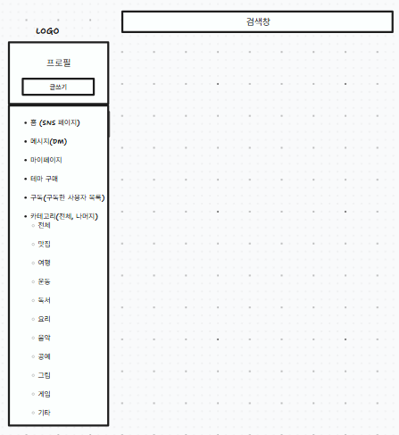
### 1.2.1 로그인 화면(`/login`)
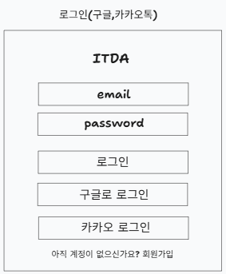
- 출력 데이터 항목 (Output Data):
  - 로고 및 헤더: ITDA 서비스 로고 및 환영 문구
  - 입력 폼: 이메일 입력 필드, 비밀번호 입력 필드
  - 제어 버튼: 로그인 버튼, 간편 구글, 카카오 소셜 로그인 버튼, 회원가입 전환 링크
- 화면 제어 및 동작 규칙 (Behavior Rules):
  - 이메일 형식 정규식 및 비밀번호(영문/숫자/특수문자 8자리 이상) 유효성 실시간 검증
  - 로그인 성공 시 서버로부터 수신한 Access Token을 메모리/상태에 저장하고 메인 피드 화면으로 리다이렉트
  - 로그인 실패 시 에러 메시지(아이디 또는 비밀번호 불일치) 노출

### 1.2.2 회원가입 화면 (`/signup`)
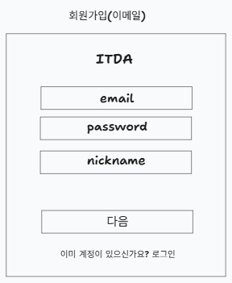 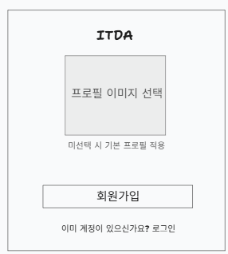
- 출력 데이터 항목 (Output Data):
  - 회원가입 항목: 이메일 입력 필드, 비밀번호 입력 필드, 닉네임 입력 필드, 프로필 사진 업로드 필드

### 1.2.3 메인 게시글 목록 화면(로그인 시) (`/posts`)
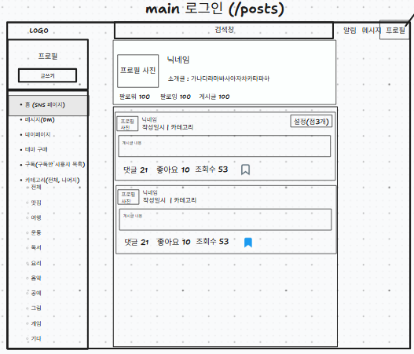
- 출력 데이터 항목 (Output Data):
  - 좌측 내비게이션 바(GNB): 홈, 마이페이지, 테마구매, 구독, 카테고리 (전체, 맛집, 여행, 운동, 독서, 요리, 음악, 공예, 그림, 게임, 기타)
  - 중앙 피드 스트림: 게시글 카드 목록 (작성자 프로필, 닉네임, 작성 시간, 게시글 이미지, 본문 내용, 카테고리)
  - 상호작용 요소: 하트 아이콘(좋아요 수), 말풍선 아이콘(댓글 수), 스크랩 아이콘
  - 우측 상단(로그인 시): 알림, 메시지, 프로필
- 화면 제어 및 동작 규칙 (Behavior Rules):
  - 스크롤 하단 도달 시 다음 페이지 피드 자동 요청 (무한 스크롤)
  - 카테고리 클릭 시 해당 카테고리 필터링 목록 화면으로 이동
  - 게시글 본문 또는 이미지 클릭 시 피드 상세 모달 창 활성화
  - 좋아요 아이콘 클릭 시 빨간색 채움 상태로 토글 및 카운트 +1 즉각 반영 
  - 스크랩 아이콘 클릭 시 저장 상태 토글

### 1.2.4 메인 게시글 목록 화면(로그아웃 시) (`/posts`)
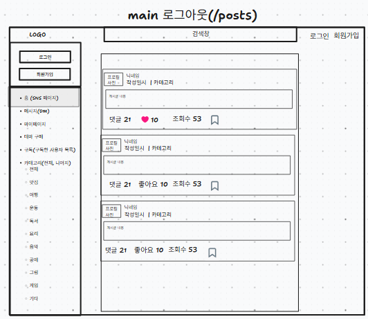
- 출력 데이터 항목 (Output Data):
  - 좌측 내비게이션 바(GNB): 홈, 마이페이지, 테마구매, 구독, 카테고리 (전체, 맛집, 여행, 운동, 독서, 요리, 음악, 공예, 그림, 게임, 기타)
  - 중앙 피드 스트림: 게시글 카드 목록 (작성자 프로필, 닉네임, 작성 시간, 게시글 이미지, 본문 내용, 카테고리)
  - 상호작용 요소: 하트 아이콘(좋아요 수), 말풍선 아이콘(댓글 수), 스크랩 아이콘
  - 우측 상단(로그아웃 시): 로그인, 회원가입
- 화면 제어 및 동작 규칙 (Behavior Rules):
  - 스크롤 하단 도달 시 다음 페이지 피드 자동 요청 (무한 스크롤)
  - 카테고리 클릭 시 해당 카테고리 필터링 목록 화면으로 이동
  - 게시글 본문 또는 이미지 클릭 시 피드 상세 모달 창 활성화
  - 좋아요 아이콘 클릭 시 빨간색 채움 상태로 토글 및 카운트 +1 즉각 반영
  - 스크랩 아이콘 클릭 시 저장 상태 토글
    
### 1.2.5 메인 게시글 목록 화면(카테고리 눌렀을 시) (`/posts/{categoryId}`)
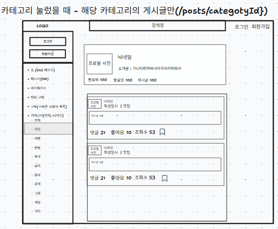
- 출력 데이터 항목 (Output Data):
  - 좌측 내비게이션 바(GNB): 홈, 마이페이지, 테마구매, 구독, 카테고리 (전체, 맛집, 여행, 운동, 독서, 요리, 음악, 공예, 그림, 게임, 기타)
  - 중앙 피드 스트림: 게시글 카드 목록 (작성자 프로필, 닉네임, 작성 시간, 게시글 이미지, 본문 내용, 카테고리)
  - 우측 상단(비로그인 시): 로그인, 회원가입
- 화면 제어 및 동작 규칙 (Behavior Rules):
  - 스크롤 하단 도달 시 다음 페이지 피드 자동 요청 (무한 스크롤)
  - 카테고리 클릭 시 해당 카테고리 필터링 목록 화면으로 이동
  - 게시글 본문 또는 이미지 클릭 시 피드 상세 모달 창 활성화
  - 좋아요 아이콘 클릭 시 빨간색 채움 상태로 토글 및 카운트 +1 즉각 반영
  - 스크랩 아이콘 클릭 시 저장 상태 토글

### 1.2.6 게시글 상세 조회 및 댓글 모달 화면 (`/posts/{postId}`)
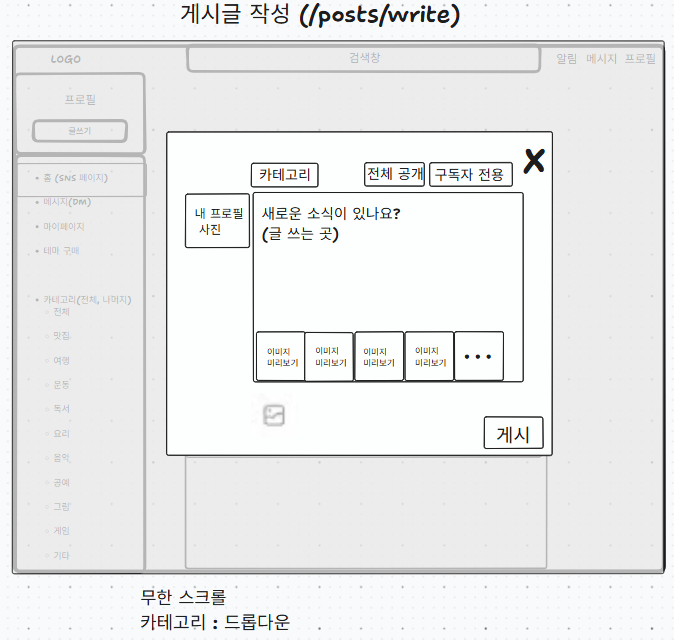

- 출력 데이터 항목 (Output Data):
  - 상단 영역: 작성자 프로필, 닉네임
  - 중앙 영역: 작성자 글, 이미지
  - 중앙 하단 영역: 댓글, 좋아요, 조회수, 스크랩
  - 하단 영역: 댓글(작성자 프로필, 작성자 닉네임, 글, 설정(작성자에게만 보임))
- 화면 제어 및 동작 규칙 (Behavior Rules):
  - 본인이 작성한 게시글인 경우에만 수정/삭제 옵션 노출
  - 댓글 입력창에 내용 입력 후 전송 시 즉시 댓글 목록 최하단에 렌더링
  - 본인이 작성한 댓글에만 설정(점 3개) 노출 및 수정 또는 삭제 옵션 노출

### 1.2.7 게시글 작성 화면 (`/posts/write`)
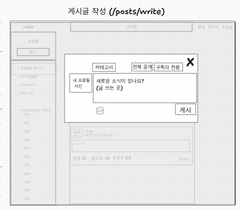

- 출력 데이터 항목 (Output Data):
  - 상단 바: 카테고리 드롭다운,전체 공개 버튼, 구독자 전용 공개 버튼, 게시글 작성창 닫기 버튼(X)
  - 중앙 영역: 내 프로필 사진, 게시글 내용 입력하는 텍스트 영역, 게시글 입력 안내 문구 표시("새로운 소식이 있나요?")
  - 하단 영역: 이미지 업로드 버튼, 게시 버튼
- 화면 제어 및 동작 규칙 (Behavior Rules):
  - 카테고리 버튼 클릭 시 게시글에 적용할 카테고리를 선택
  - 전체 공개 클릭 시 모든 사용자가 게시글을 조회할 수 있도록 공개 범위를 설정
  - 구독자 전용 클릭 시 작성자를 구독 중인 사용자만 게시글을 조회할 수 있도록 공개 범위를 설정
  - 게시글 작성 영역에 사용자가 게시할 내용을 입력
  - 이미지 업로그 버튼 클릭 시 게시글에 첨부할 이미지 파일을 선택
  - 이미지 선택 시 선택한 이미지를 게시글에 첨부
  - 게시 버튼 클릭 시 선택한 카테고리, 공개 범위, 게시글 내용, 첨부 이미지 정보를 서버로 전송하여 게시글 등록
  - 등록 완료 시 메인 게시글 최상단으로 이동
  - 게시글 작성창 닫기 버튼(X) 버튼 클릭 시 게시글 작성 영역을 닫음

### 1.2.8 게시글 수정 화면 (`/posts/edit`)
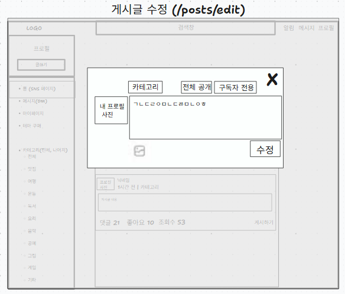

- 출력 데이터 항목 (Output Data):
  - 상단 바: 카테고리 드롭다운,전체 공개 버튼, 구독자 전용 공개 버튼, 게시글 수정창 닫기 버튼(X)
  - 중앙 영역: 내 프로필 사진, 게시글 수정하는 텍스트 영역
  - 하단 영역: 이미지 업로드 버튼, 수정 버튼
- 화면 제어 및 동작 규칙 (Behavior Rules):
  - 카테고리 버튼 클릭 시 게시글에 적용할 카테고리를 선택
  - 전체 공개 클릭 시 모든 사용자가 게시글을 조회할 수 있도록 공개 범위를 설정
  - 구독자 전용 클릭 시 작성자를 구독 중인 사용자만 게시글을 조회할 수 있도록 공개 범위를 설정
  - 게시글 작성 영역에 사용자가 수정할 내용을 입력
  - 이미지 업로그 버튼 클릭 시 게시글에 첨부할 이미지 파일을 선택
  - 이미지 선택 시 선택한 이미지를 게시글에 첨부
  - 수정 버튼 클릭 시 선택한 카테고리, 공개 범위, 게시글 내용, 첨부 이미지 정보를 서버로 전송하여 게시글 수정
  - 수정 완료 시 메인 게시글 최상단으로 이동
  - 게시글 수정창 닫기 버튼(X) 클릭 시 게시글 수정 영역을 닫음
  
### 1.2.9 마이페이지 화면 (`/mypage`)
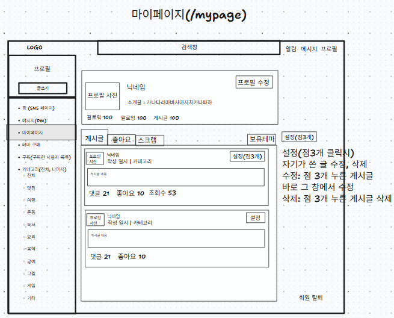
- 출력 데이터 항목 (Output Data):
  - 상단 영역: 내 프로필 사진, 닉네임, 한 줄 소개, 팔로워 수, 팔로잉 수, 게시글 수
  - 중단 영역: 게시글, 좋아요, 스크랩, 보유테마 탭
- 화면 제어 및 동작 규칙 (Behavior Rules):
  - 프로필 수정 버튼 클릭 시 프로필 정보 수정 모달 띄움
  - 게시글 탭 클릭시 사용자가 작성한 게시글 목록을 표시
  - 게시글 클릭시 해당 게시글의 상세 화면으로 이동
  - 좋아요 탭 클릭시 사용자가 좋아요한 게시글 목록을 표시
  - 스크랩 탭 클릭시 사용자가 스크랩한 게시글 목록을 표시
  - 보유 테마 버튼 클릭 시 사용자가 보유한 테마 목록을 확인할 수 있는 화면으로 이동
  - 회원 탈퇴 버튼 클릭 시 회원 탈퇴 절차 진행

### 1.2.10 마이페이지 좋아요(`/mypage/postlike`)
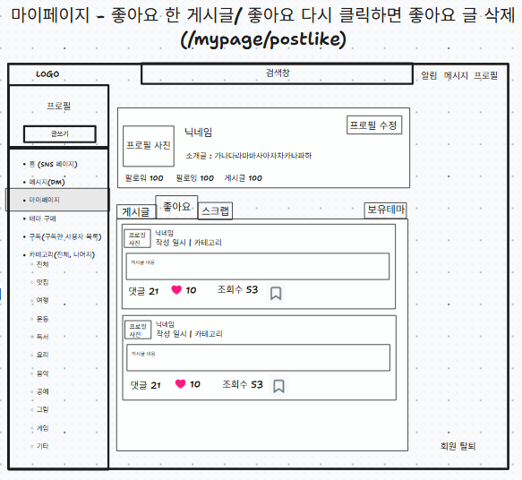

- 출력 데이터 항목 (Output Data):
  - 상단 영역: 내 프로필 사진, 닉네임, 한 줄 소개, 팔로워 수, 팔로잉 수, 게시글 수
  - 중단 영역: 게시글, 좋아요, 스크랩, 보유테마 탭
  - 좋아요: 사용자가 좋아요 한 게시글 (프로필, 닉네임, 작성일시, 카테고리, 설정, 댓글 수, 좋아요 수, 조회 수)
- 화면 제어 및 동작 규칙 (Behavior Rules):
  - 좋아요한 게시글의 프로필 사진 클릭 시 해당 게시글을 작성한 작성자의 프로필 화면으로 이동
  - 좋아요한 게시글을 클릭시 해당 게시글의 상세 화면으로 이동
  - 회원 탈퇴 버튼 클릭 시 회원 탈퇴 절차 진행
  
### 1.2.11 마이페이지 스크랩(`/mypage/scrap/`)
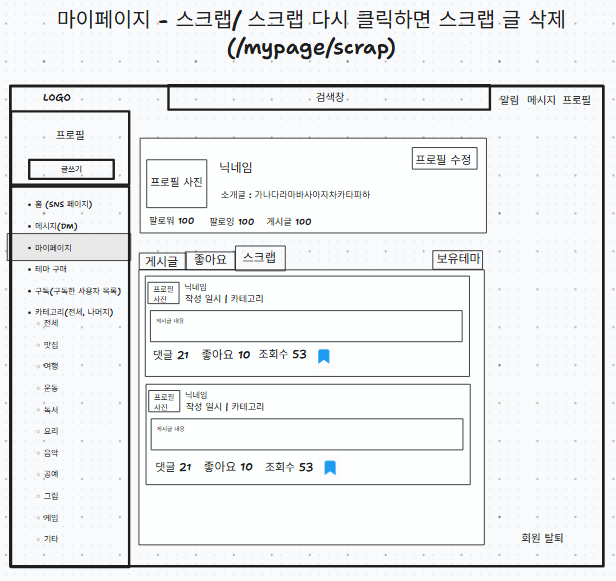

- 출력 데이터 항목 (Output Data):
  - 상단 영역: 내 프로필 사진, 닉네임, 한 줄 소개, 팔로워 수, 팔로잉 수, 게시글 수
  - 중단 영역: 게시글, 좋아요, 스크랩, 보유테마 탭
  - 스크랩: 사용자가 스크랩한 게시글 (프로필, 닉네임, 작성일시, 카테고리, 설정, 댓글 수, 좋아요 수, 조회 수)
- 화면 제어 및 동작 규칙 (Behavior Rules):
  - 스크랩한 게시글의 프로필 사진 클릭시 해당 게시글을 작성한 작성자의 프로필 화면으로 이동
  - 스크랩한 게시글을 클릭시 해당 게시글의 상세 화면으로 이동
  - 회원 탈퇴 버튼 클릭 시 회원 탈퇴 절차 진행

### 1.2.12 마이페이지 - 고객센터
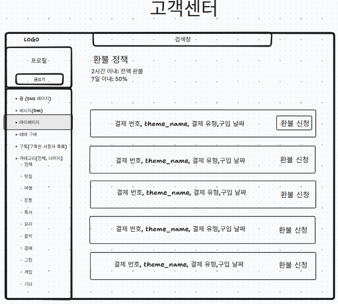
- 출력 데이터 항목 (Output Data):
  - 상단 영역: 환불 정책 안내 문구
  - 중단 영역: 결제 내역 목록(결제 번호, 테마 이름, 결제 유형, 구입 날짜, 환불 신청 버튼)
- 화면 제어 및 동작 규칙 (Behavior Rules):
  - 환불 신청 가능 대상을 결제 내역 목록으로 조회한다.
  - 환불 신청 버튼 클릭 시 해당 결제 건에 대한 환불 신청을 진행한다.
  - 환불 가능 여부는 구매일 기준 환불 정책에 따라 환불 가능여부를 결정한다.
  - 환불 신청 완료 시 처리 결과 메시지를 출력한다.
  
### 1.2.13 마이페이지 - 보유 테마(`/mypage/theme`)
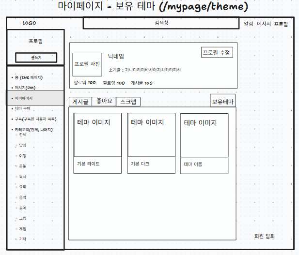

- 출력 데이터 항목 (Output Data):
  - 상단 영역: 내 프로필 사진, 닉네임, 한 줄 소개, 팔로워 수, 팔로잉 수, 게시글 수
  - 중단 영역: 게시글, 좋아요, 스크랩, 보유테마 탭
  - 보유테마: 사용자가 구매한 테마 
- 화면 제어 및 동작 규칙 (Behavior Rules):
  - 사용자가 구매한 테마 목록 표시
  - 각 테마 항목에 이미지와 테마 이름 표시
  - 회원 탈퇴 버튼 클릭 시 회원 탈퇴 절차 진행

### 1.2.14 마이페이지 - 테마 상세 페이지 (모달)
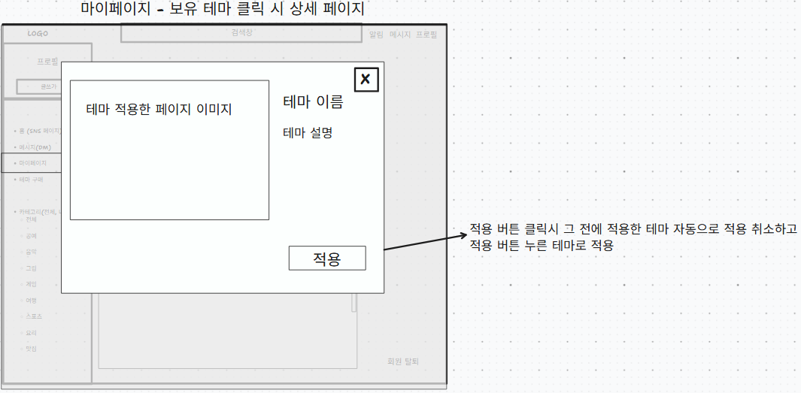

- 출력 데이터 항목 (Output Data):
  - 좌측 영역: 테마 적용 화면 미리보기 이미지
  - 우측 영역: 테마 이름, 테마 설명, 테마 상세 페이지 창 닫기(X) 버튼
  - 하단 영역: 테마 적용 버튼
- 화면 제어 및 동작 규칙 (Behavior Rules):
  - 보유한 테마 목록에서 특정 테마를 클릭 시 해당 테마의 상세 페이지를 표시
  - 선택한 테마의 미리보기 이미지, 테마 이름, 테마 설명 표시
  - 새로운 테마 적용 시 기존에 적용되어 있던 테마는 해제 처리
  - 테마 적용 완료 시 선택한 테마가 화면에 반영
  - 이미 적용 중인 테마인 경우 중복 적용되지 않도록 처리
  - 테마 상세 페이지 창 닫기(X) 버튼 클릭시 해당 창 나가기

### 1.2.15 마이페이지 - 설정
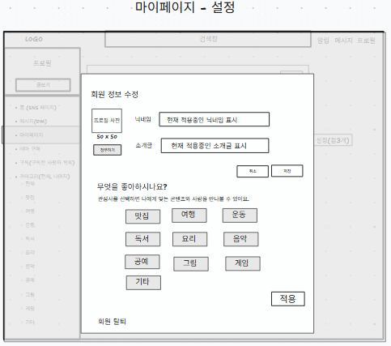
- 출력 데이터 항목 (Output Data):
  - 상단 영역: 프로필 사진, 닉네임, 소개글
  - 중단 영역: 관심사 선택 목록(맛집, 여행, 운동, 독서, 요리, 음악, 공연, 그림, 게임, 기타)
  - 하단 영역: 취소 버튼, 저장 버튼, 적용 버튼, 회원 탈퇴 버튼

- 화면 제어 및 동작 규칙 (Behavior Rules):
  - 프로필 사진, 닉네임, 소개글을 수정할 수 있도록 처리
  - 관심사 목록에서 원하는 관심사를 선택하거나 해제할 수 있도록 처리
  - 저장 버튼 클릭 시 수정한 회원 정보를 저장
  - 취소 버튼 클릭 시 수정한 내용을 반영하지 않고 기존 정보 유지
  - 적용 버튼 클릭 시 선택한 관심사를 저장하고 사용자 관심사에 반영
  - 기존에 선택한 관심사는 현재 선택 상태로 표시
  - 회원 탈퇴 버튼 클릭 시 회원 탈퇴 팝업 표시

### 1.2.16 마이페이지 - 회원 탈퇴
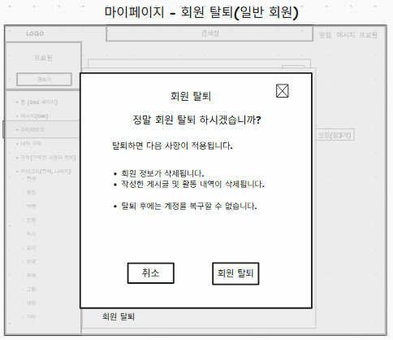 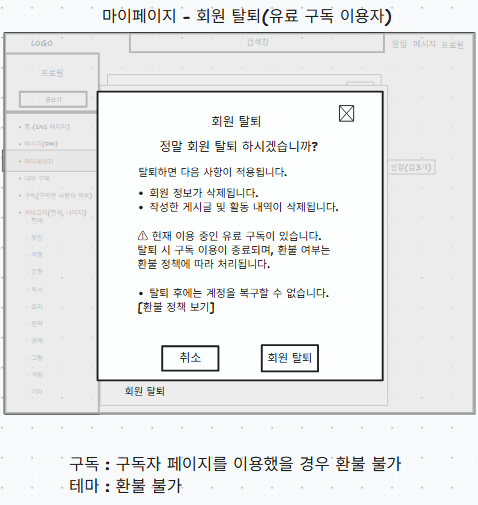
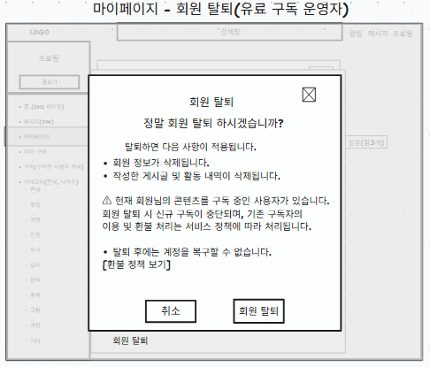 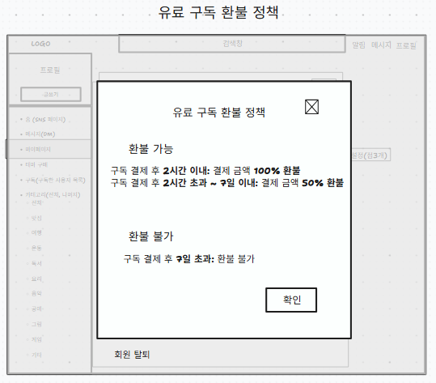

- 출력 데이터 항목 (Output Data):
  - 상단 영역: 팝업 닫기(X) 버튼
  - 회원탈퇴 안내 영역: 회원 탈퇴 여부를 확인하는 안내 문구
  - 하단 영역: 취소, 회원 탈퇴 버튼
- 화면 제어 및 동작 규칙 (Behavior Rules):
  - 회원 탈퇴 버튼 클릭 시 회원 탈퇴 확인 팝업 표시
  - 회원 탈퇴 시 회원 정보 삭제, 게시글, 댓글 삭제됩니다 문구 안내
  - 회원 탈퇴 버튼 클릭 시 회원이 유료 구독 이용자인 경우 현재 이용중인 유료 구독이 있음을 안내 
  - 회원 탈퇴 버튼 클릭 시 회원이 유료 구독 창작자인 경우 해당 회원에 대한 신규 구독 중단 및 기존 구독자에 대한 환불 정책 안내
  - 회원 탈퇴 완료 시 로그아웃 처리 후 메인 화면으로 이동
  - 팝업 닫기(X) 버튼 클릭 시 회원 탈퇴 취소하고 팝업 닫기

### 1.2.17 테마 구매(`/theme`)
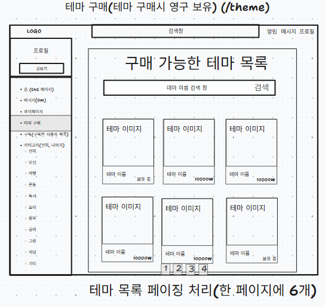
- 출력 데이터 항목 (Output Data):
  - 상단 영역: 제목, 테마 이름 검색창
  - 중앙 영역: 구매 가능한 테마 목록, 테마별 이미지, 테마 이름
  - 하단 영역: 테마 목록 페이징
- 화면 제어 및 동작 규칙 (Behavior Rules):
  - 테마 구매 페이지 진입 시 현재 구매 가능한 테마 목록 표시
  - 테마 이름을 검색창에 검색 시 입력한 이름과 일치하거나 포함되는 테마 목록 조회
  - 검색 결과가 없는 경우 테마 미표시
  - 각 테마 항목에 테마 이미지와 테마 이름 표시
  - 특정 테마 클릭시 해당 테마의 구매 페이지로 이동
  - 한 페이지에 6개 개수의 테마만 표시
  - 페이지 번호 클릭시 다음 테마 목록 조회
  - 구매한 테마는 기간 제한 없이 영구 소장
  - 구매 완료된 테마는 마이페이지의 보유 테마 페이지에서 확인 가능
  - 이미 구매한 테마의 경우 보유 중으로 표시

### 1.2.18 테마 구매 페이지(`/theme/{themeId}`)
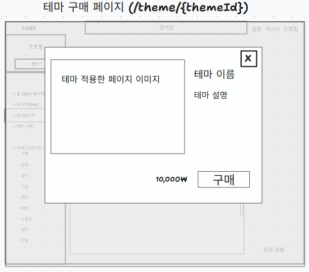
- 출력 데이터 항목 (Output Data):
  - 상단 영역: 선택한 테마의 적용 화면 미리보기 이미지, 테마 이름, 테마 설명, 테마 구매 페이지 창 닫기(X) 버튼
  - 하단 영역: 테마 판매 가격, 구매 버튼
- 화면 제어 및 동작 규칙 (Behavior Rules):
  - 테마 구매 페이지에서 구매하고자 하는 테마를 클릭하면 해당 테마의 구매 상세 페이지로 이동
  - 선택한 테마의 미리보기 이미지, 테마 이름, 테마 설명, 테마 판매 가격을 표시
  - 구매 클릭시 결제 진행
  - 결제 성공 시 해당 테마를 사용자의 보유 테마에 등록
  - 구매 완료된 
  - 회원 탈퇴 완료 시 로그아웃 처리 후 메인 화면으로 이동
  - 테마 구매 페이지 창 닫기(X) 버튼 클릭 시 테마 구매 페이지 닫기
  - 
### 1.2.19 구독 페이지
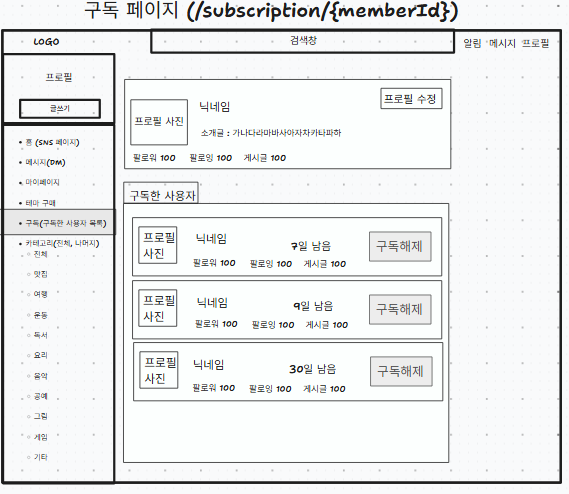
- 출력 데이터 항목 (Output Data):
  - 상단 영역: 내 프로필 사진, 닉네임, 한 줄 소개, 팔로워 수, 팔로잉 수, 게시글 수
  - 중단 영역: 구독한 사용자 목록, 구독한 사용자 프로필 사진, 구독한 사용자 팔로워 수, 구독한  사용자 팔로잉 수,구독한 사용자 게시글 수,구독 종료일까지 남은 기간, 구독 해제 버튼  
  - 하단 영역: 구독한 사용자가 더 있으면 무한 스크롤로 표시
- 화면 제어 및 동작 규칙 (Behavior Rules):
  - 구독 페이지 진입 시 현재 로그인한 사용자가 구독 중인 사용자 목록 표시
  - 각 구독 사용자 항목에 프로필 사진, 닉네임, 팔로워 수, 팔로잉 수, 게시글 수 표시
  - 구독 종료일과 현재 시간을 기준으로 남은 구독 기간을 계산하여 표시
  - 구독 사용자 프로필 영역 클릭 시 해당 사용자의 프로필 페이지로 이동
  - 구독 해지 버튼 클릭시 해당 사용자를 구독 목록에서 제거
  - 구독 기간이 만료된 경우 구독 상태를 종료 처리하고 구독 목록에서 제외

### 1.2.20 관리자 페이지 - 회원관리
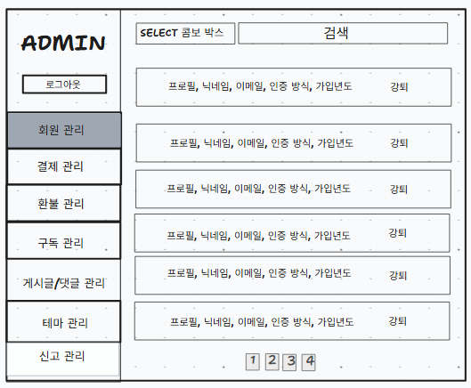
- 출력 데이터 항목 (Output Data):
  - 상단 영역: 검색 조건 선택 박스(닉네임, 이메일, 인증방식), 검색 입력창
  - 회원 목록 영역: 프로필, 닉네임, 이메일, 인증 방식, 가입년도, 강퇴 버튼
  - 하단 영역: 페이지네이션 버튼

- 화면 제어 및 동작 규칙 (Behavior Rules):
  - 검색 조건 선택 후 검색어 입력 시 해당 조건에 맞는 회원 목록 조회
  - 회원 목록에 프로필, 닉네임, 이메일, 인증 방식, 가입년도 표시
  - 한 페이지 당 6개씩 표시
  - 강퇴 버튼 클릭 시 해당 회원의 강퇴 절차 진행
  - 강퇴 완료 시 해당 회원을 회원 목록에서 제거 또는 상태 변경 처리
  - 페이지 번호 클릭 시 해당 페이지의 회원 목록 표시
  - 검색 결과가 없을 경우 검색 결과 없음 안내 표시

### 1.2.21 관리자 페이지 - 결제 관리
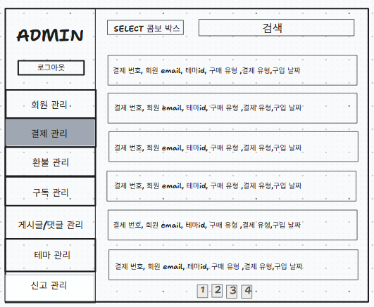
- 출력 데이터 항목 (Output Data):
  - 상단 영역: 검색 조건 선택 박스, 검색 입력창
  - 결제 목록 영역: 결제 번호, 회원 이메일, 테마 ID, 구매 유형, 결제 유형, 구입 날짜
  - 하단 영역: 페이지네이션 버튼

- 화면 제어 및 동작 규칙 (Behavior Rules):
  - 검색 조건 선택 후 검색어 입력 시 해당 조건에 맞는 결제 내역 조회
  - 결제 목록에 결제 번호, 회원 이메일, 테마 ID, 구매 유형, 결제 유형, 구입 날짜 표시
  - 한 페이지 당 6개씩 표시
  - 특정 결제 내역 클릭 시 해당 결제의 상세 정보 표시
  - 페이지 번호 클릭 시 해당 페이지의 결제 내역 표시
  - 검색 결과가 없을 경우 검색 결과 없음 안내 표시

### 1.2.22 관리자 페이지- 환불 관리
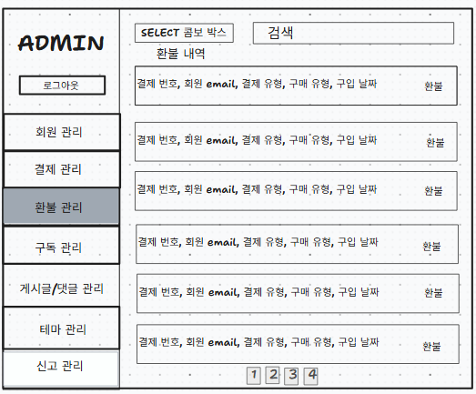
- 출력 데이터 항목 (Output Data):
  - 상단 영역: 검색 조건 선택 박스, 검색 입력창, 환불 내역 제목
  - 환불 목록 영역: 결제 번호, 회원 이메일, 결제 유형, 구매 유형, 구입 날짜, 환불 버튼
  - 하단 영역: 페이지네이션 버튼

- 화면 제어 및 동작 규칙 (Behavior Rules):
  - 검색 조건 선택 후 검색어 입력 시 해당 조건에 맞는 환불 대상 결제 내역 조회
  - 환불 목록에 결제 번호, 회원 이메일, 결제 유형, 구매 유형, 구입 날짜 표시
  - 한 페이지 당 6개씩 표시
  - 환불 버튼 클릭 시 해당 결제 건의 환불 처리 진행
  - 환불 처리 완료 시 해당 결제 건의 상태를 환불 완료로 변경
  - 이미 환불된 결제 건은 중복 환불되지 않도록 처리
  - 페이지 번호 클릭 시 해당 페이지의 환불 내역 표시
  - 검색 결과가 없을 경우 검색 결과 없음 안내 표시

### 1.2.23 괸리자 페이지 - 구독 관리
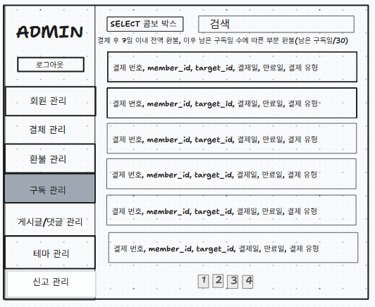

- 출력 데이터 항목 (Output Data):
  - 상단 영역: 검색 조건 선택 박스, 검색 입력창, 구독 환불 정책 안내 문구
  - 구독 목록 영역: 결제 번호, 회원 ID(member_id), 구독 대상 ID(target_id), 결제일, 만료일, 결제 유형
  - 하단 영역: 페이지네이션 버튼

- 화면 제어 및 동작 규칙 (Behavior Rules):
  - 검색 조건 선택 후 검색어 입력 시 해당 조건에 맞는 구독 내역 조회
  - 구독 목록에 결제 번호, 회원 ID, 구독 대상 ID, 결제일, 만료일, 결제 유형 표시
  - 페이지 번호 클릭 시 해당 페이지의 구독 내역 표시
  - 검색 결과가 없을 경우 검색 결과 없음 안내 표시

### 1.2.24 관리자 페이지 - 게시글/댓글 관리
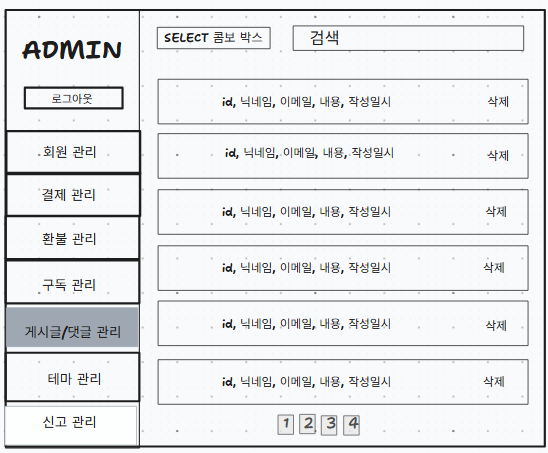 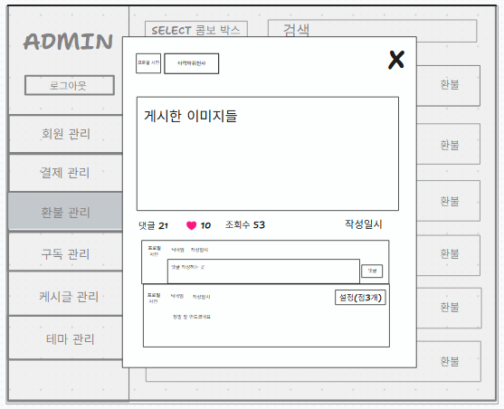
- 출력 데이터 항목 (Output Data):
  - 상단 영역: 검색 조건 선택 박스, 검색 입력창
  - 게시글/댓글 목록 영역: ID, 닉네임, 이메일, 내용, 작성일시, 삭제 버튼
  - 하단 영역: 페이지네이션 버튼
  - 게시글 상세 페이지: 해당 게시글 작성사의 프로필 사진, 닉네임, 이미지, 댓글, 미트볼 메뉴(점3개)

- 화면 제어 및 동작 규칙 (Behavior Rules):
  - 검색 조건 선택 후 검색어 입력 시 해당 조건에 맞는 게시글 또는 댓글 목록 조회
  - 목록에 ID, 닉네임, 이메일, 내용, 작성일시 표시
  - 삭제 버튼 클릭 시 해당 게시글 삭제 
  - 해당 게시글 클릭시 게시글 상세 페이지로 이동
  - 관리자는 게시글 상세 페이지에서 미트볼 메뉴(점3개)에서 삭제버튼을 눌러 삭제 가능
  - 삭제 완료 시 해당 게시글 목록에서 제거
  - 페이지 번호 클릭 시 해당 페이지의 목록 표시
  - 검색 결과가 없을 경우 검색 결과 없음 안내 표시

### 1.2.25 관리자 페이지 - 테마 관리
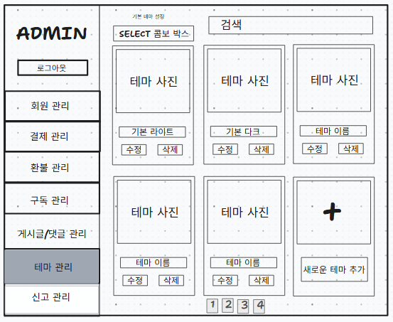

- 출력 데이터 항목 (Output Data):
  - 상단 영역: 검색 조건 선택 박스, 검색 입력창
  - 테마 목록 영역: 테마 이미지, 테마 이름, 수정 버튼, 삭제 버튼
  - 테마 추가 영역: 새로운 테마 추가 버튼
  - 하단 영역: 페이지네이션 버튼

- 화면 제어 및 동작 규칙 (Behavior Rules):
  - 검색 조건 선택 후 검색어 입력 시 해당 조건에 맞는 테마 목록 조회
  - 테마 목록에 테마 이미지와 테마 이름 표시
  - 수정 버튼 클릭 시 해당 테마의 정보 수정 화면 표시
  - 삭제 버튼 클릭 시 해당 테마 삭제 절차 진행
  - 기본 테마는 삭제되지 않도록 처리
  - 새로운 테마 추가 버튼 클릭 시 테마 등록 화면 표시
  - 테마 등록 완료 시 목록에 새로운 테마 반영
  - 페이지 번호 클릭 시 해당 페이지의 테마 목록 표시
  - 검색 결과가 없을 경우 검색 결과 없음 안내 표시

### 1.2.26 관리자 페이지 - 신고 관리
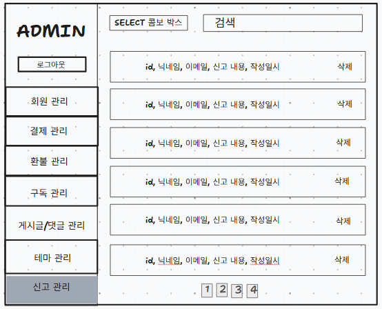
- 출력 데이터 항목 (Output Data):
  - 상단 영역: 검색 조건 선택 박스, 검색 입력창
  - 신고 목록 영역: ID, 닉네임, 이메일, 신고 내용, 작성일시, 삭제 버튼
  - 하단 영역: 페이지네이션 버튼

- 화면 제어 및 동작 규칙 (Behavior Rules):
  - 검색 조건 선택 후 검색어 입력 시 해당 조건에 맞는 신고 내역 조회
  - 신고 목록에 ID, 닉네임, 이메일, 신고 내용, 작성일시 표시
  - 신고 내역 클릭 시 해당 신고의 상세 내용 확인
  - 삭제 버튼 클릭 시 해당 신고 내역 삭제 처리
  - 삭제 전 확인 메시지를 표시하여 삭제 여부 확인
  - 삭제 완료 시 해당 신고 내역을 목록에서 제거
  - 페이지 번호 클릭 시 해당 페이지의 신고 목록 표시
  - 검색 결과가 없을 경우 검색 결과 없음 안내 표시

### 1.2.15 1:1 메시지 페이지(`/message`)
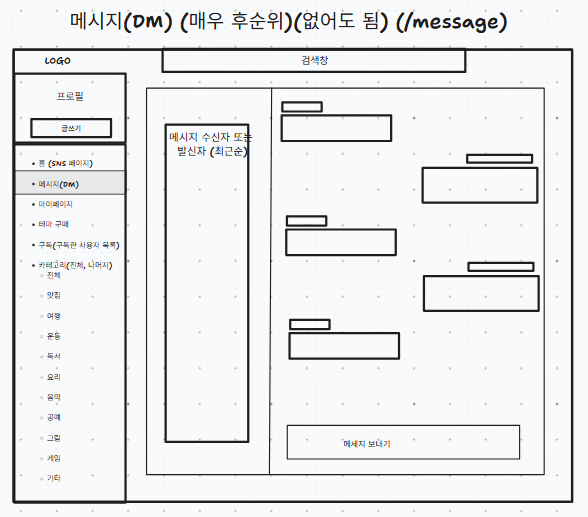
- 출력 데이터 항목 (Output Data):
  - 좌측 영역: 메시지 수신자 또는 발신자 목록, 대화 상대 프로필 및 닉네임 표시
  - 중단 영역: 선택한 사용자와의 메시지 대화 내용
  - 하단 영역: 메시지 입력창, 메시지 보내기 버튼
- 화면 제어 및 동작 규칙 (Behavior Rules):
  - 메시지를 주고받은 사용자 목록 표시
  - 좌측 사용자 목록에서 특정 사용자를 클릭하면 해당 사용자와의 대화 내용 조회
  - 상대방이 보낸 메시지 좌측에 표시
  - 내가 보낸 메시지는 우측에 표시
  - 메시지 버튼 클릭시 현재 선택한 사용자에게 메시지 전송
---

## 1.3 전체 화면 와이어프레임 배치도

